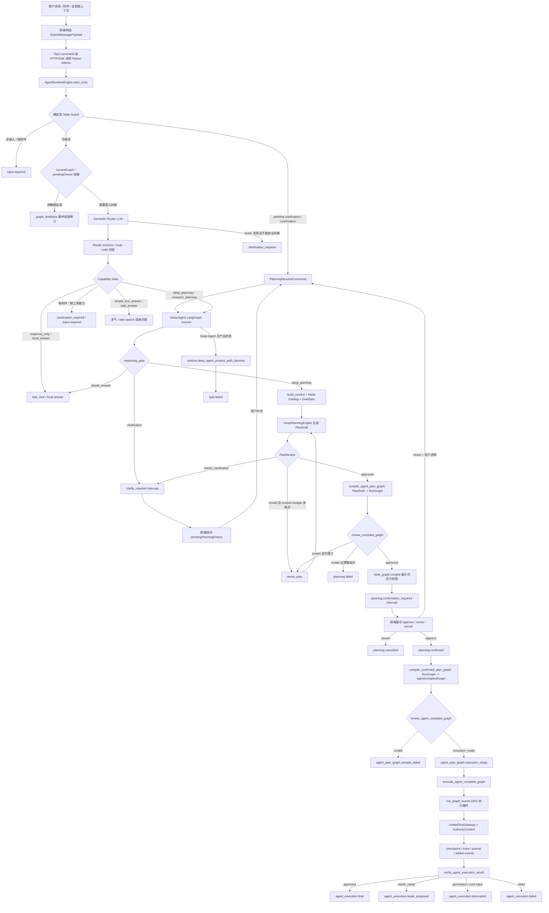

# Agent解读

生成日期：2026-06-07

本文档面向外部 AI Agent 或新接手的工程师。目标是让读者不依赖对话上下文，也能理解 Alita 当前项目的产品定位、技术结构、Agent 框架、算法边界、行为编排逻辑、关键源码和当前开发状态。

## 1. 项目一句话定位

Alita 是一个本地优先的 Windows AI Agent 桌面工作台。它不是普通聊天 UI，而是把本地大模型、Tauri 桌面壳、React 节点画布、Python FastAPI sidecar、LangGraph 深度规划、工具执行、联网研究、文档处理、运行 checkpoint、artifact 预览、语音输入和项目文件持久化组织成一个 Agent 产品。

当前仓库版本是 `0.36.1`。当前开发主线已经从“模板化 workflow 生成器”迁移到“Semantic Router + Deep Agent Runtime + Agent Plan Graph + Execute/Verify/Repair”的 Agent runtime。

## 2. 本次扫描范围

本次解读扫描的是项目根目录 `D:\Software Project\Alita`。为了理解项目源码，统计和阅读时排除了 `.git`、`node_modules`、`dist`、`coverage`、`__pycache__`、`.pyc` 等依赖或生成目录；同时识别了 `models` 和 `node-runs` 这类运行数据目录。

扫描到的主要项目文件约 443 个：

| 类型 | 数量 |
| --- | ---: |
| Python `.py` | 187 |
| Markdown `.md` | 103 |
| TypeScript `.ts` | 51 |
| Rust `.rs` | 33 |
| React TSX `.tsx` | 26 |
| PowerShell `.ps1` | 17 |
| JSON / JSONL / TOML / HTML 等 | 46 |

顶层目录分布：

| 目录 | 说明 |
| --- | --- |
| `python/agent_service` | Python Agent sidecar，包含路由、LangGraph runtime、工具网关、执行器、checkpoint、研究和模型调用 |
| `python/tests` | Python Agent 测试和 eval 相关测试 |
| `src` | React + TypeScript 前端工作台 |
| `src-tauri` | Rust / Tauri 2 桌面壳、命令桥、首选项、模型和 sidecar 管理 |
| `tool-packages` | 工具 manifest，例如 MarkItDown、Typst、document 工具 |
| `docs` | 设计文档、计划、审计、测试追踪和运行说明 |
| `scripts` | Windows 开发、构建、验证脚本 |
| `models` | 本地模型目录；当前有约 22GB 的 GGUF 文件，不应提交或复制 |
| `node-runs` | 运行时 checkpoint / SQLite / journal 数据，属于运行产物 |

当前 git 状态中已存在一个未跟踪文件：`docs/agent-runtime-node-map.html`。本文档新增为根目录 `Agent解读.md`，不会修改这个未跟踪文件，也不会影响项目运行。

## 3. 技术栈总览

```text
React / TypeScript / Vite
  -> Tauri invoke + local HTTP/SSE
Rust / Tauri 2 desktop shell
  -> sidecar process + auth token + model runtime env
Python FastAPI Agent sidecar
  -> AgentRuntimeEngine
  -> Semantic Router
  -> LangGraph Deep Agent Runtime
  -> Unified Tool Gateway
  -> run_graph_events execution loop
llama.cpp / OpenAI-compatible API / MarkItDown / Typst / Web providers / ASR
```

主要入口文件：

| 层 | 文件 |
| --- | --- |
| 前端应用装配 | `src/app/App.tsx` |
| 前端后端事件 reducer | `src/app/backendEvents.ts` |
| 前端 Agent API / SSE | `src/features/task/useTaskEvents.ts` |
| 节点画布 | `src/features/canvas/NodeCanvas.tsx` |
| Tauri app setup | `src-tauri/src/lib.rs` |
| Tauri command 桥 | `src-tauri/src/commands.rs` |
| Tauri sidecar 管理 | `src-tauri/src/sidecar.rs` |
| Rust Agent HTTP client | `src-tauri/src/agent_client.rs` |
| FastAPI sidecar | `python/agent_service/app.py` |
| Agent runtime 门面 | `python/agent_service/agent_runtime_engine.py` |
| Semantic Router | `python/agent_service/semantic_router.py` |
| LangGraph Deep Agent | `python/agent_service/deep_agent_runtime_graph.py` |
| Deep planner | `python/agent_service/deep_agent_planner.py` |
| PlanDraft -> RunGraph | `python/agent_service/deep_agent_graph_compile.py` |
| Confirmed graph -> AgentCompiledGraph | `python/agent_service/agent_plan_compile.py` |
| RunGraph execution | `python/agent_service/execution.py` |
| Tool gateway | `python/agent_service/tool_gateway.py` |

## 4. Agent 总体行为编排

当前主路径可以概括为：

```text
用户消息
  -> 前端构造 SubmitMessagePayload
  -> Tauri / HTTP 发送到 Python sidecar
  -> AgentRuntimeEngine.start_run()
  -> 确定性 State Guard
  -> currentGraph / pendingChoice 处理
  -> Semantic Router LLM
  -> Capability Gate
  -> 快速回复路径 或 Deep Agent LangGraph
  -> PlanDraft
  -> PlanReview
  -> RunGraph 编译与 review
  -> 前端展示节点图并等待确认
  -> 用户 approve / revise / cancel
  -> LangGraph interrupt resume
  -> AgentCompiledGraph 编译与 review
  -> execution_ready
  -> run_graph_events 执行
  -> Agent execution review
  -> final / repair_proposed / interrupted / failed
```

这条链路有一个重要产品原则：任务型产物路径不能静默回退到 legacy template graph。如果 Deep Agent 没有产出可用终态，系统会发出可解释失败事件，而不是用旧模板假装完成了 Agent 规划。

下面是更适合外部 AI 快速理解的 Agent 行为编排节点图：



## 5. RuntimeEngine：Agent 主门面

`python/agent_service/agent_runtime_engine.py` 是 Agent 消息进入后端后的主门面。它的职责不是执行所有业务逻辑，而是把请求分发到正确路径，并用 `RuntimeState` / `RuntimeStateDelta` 记录阶段变化。

### 5.1 RuntimeState 阶段

`python/agent_service/runtime_state.py` 定义了阶段：

```text
route -> context -> plan -> approve -> act -> observe -> verify -> replan -> final
failed / interrupted
```

当前任务型产品路径主要通过 Deep Agent runtime 完成，`step()` 中的 legacy plan path 默认会被阻断，除非显式打开 `allow_legacy_task_product_path`。

### 5.2 输入状态守卫

`AgentRuntimeEngine._deterministic_input_guard_result()` 只做不需要语义理解的产品状态判断：

- 空消息且无附件：返回 `input.required`。
- 用户明显要求处理文档但没有附件：返回 `input.required`。

它不会用关键词判断“这是不是任务”。语义判断交给 Semantic Router。

### 5.3 currentGraph 和 pendingChoice

如果当前已有图，RuntimeEngine 会先处理图反馈：

- 对 pending choice、明确本地修改、明确图约束反馈使用确定性 preflight。
- 否则调用 Semantic Router 判断是否是 `graph_feedback`。

如果前端传入 `pendingChoice.kind` 为：

- `planning.clarification`：转换成 `PlanningResumeCommand(kind="clarification_answer")`。
- `planning.confirmation`：转换成 `PlanningResumeCommand(kind="confirmation")`，decision 为 `approve`、`revise` 或 `cancel`。

这个 resume command 会交给 LangGraph interrupt/resume 机制，而不是新开一个无上下文规划。

### 5.4 快速回复路径和 Deep Agent 路径

RuntimeEngine 调用 `_runtime_route_result()` 后：

- `response_only`
- `local_answer`
- `simple_tool_answer`
- `web_answer`
- `clarification_required`

这些 route 可以进入 pre-deep response path，由 `graph.py` 的普通回复或简单 web/tool answer 处理。

以下 route 会进入 Deep Agent：

- `deep_planning`
- `research_planning`
- `graph_feedback` 中需要规划处理的场景

如果 Deep Agent 发出终态事件，例如 `node_graph.created`、`planning.confirmation_required`、`agent_plan_graph.execution_ready`，RuntimeEngine 认为任务路径由 Deep Agent handled。

如果 Deep Agent 只给出 `reasoning.completed` 且 `nextAction=simple_answer`，RuntimeEngine 允许回到 response-only 路径。

如果 Deep Agent 对任务路径没有发出合法终态，RuntimeEngine 发出：

- `runtime.deep_agent_product_path_blocked`
- `task.failed`，errorCode 为 `deep_agent_product_path_incomplete`

## 6. Semantic Router：自然语言判断层

主要文件：

- `python/agent_service/semantic_router.py`
- `python/agent_service/router_v2.py`
- `python/agent_service/capability_gate.py`

当前设计文档是 `docs/superpowers/specs/2026-06-07-semantic-router-agent-judgment-design.md`。

### 6.1 核心原则

自然语言意图判断由模型完成，程序只处理产品状态、schema 校验和能力边界。项目明确反对用关键词、正则或模板库作为主路由来理解“用户想做什么”。

### 6.2 Router 输出

Semantic Router 支持 8 个 route：

| route | 含义 |
| --- | --- |
| `response_only` | 问候、闲聊、普通对话 |
| `local_answer` | 不需要工具和联网的本地问答 |
| `simple_tool_answer` | 单工具可回答，例如天气 |
| `web_answer` | 简单联网事实问答 |
| `graph_feedback` | 对当前图的反馈、修改、确认 |
| `clarification_required` | 目标或输入不足 |
| `deep_planning` | 多步骤任务、文件产物、工具编排 |
| `research_planning` | 多来源研究、比较、综合、报告 |

实现上，`semantic_router.py` 让模型优先只返回一个 route code：

```text
A=response_only
B=local_answer
C=simple_tool_answer
D=web_answer
E=graph_feedback
F=clarification_required
G=deep_planning
H=research_planning
```

这样可以减少 JSON 解析失败。若模型返回 JSON，也会通过 `SemanticRouteDecision` schema 校验。若解析失败，会做一次 repair prompt；仍失败则进入 router unavailable fallback，而不是关键词 fallback。

### 6.3 Router envelope

Router 输入不是全量项目上下文，而是最小判断 envelope：

- 当前消息。
- 最近 5 条对话摘要。
- 附件名称、mime、大小。
- 当前图摘要：graphId、node count、edge count、前 12 个节点。
- pending choice 摘要。
- 可用 capability 列表。

同时会清洗本地路径和项目路径片段，避免把 `D:\Software Project\Alita` 这样的本地路径暴露给模型或日志。

### 6.4 RouterV2 兼容层

`router_v2.py` 保留 `RouterV2Decision`，用于兼容旧的 `intent`、`taskType`、`legacy_route` 和前端已有事件结构。现在 `route_message()` 默认调用 `route_semantically()`，`deterministic_route()` 只作为 legacy 兼容和测试辅助，不应作为自然语言主路由。

### 6.5 Capability Gate

`capability_gate.py` 不理解语言，只验证 Router 决策能否执行：

- Router 要求文件但没有附件：阻断并提示添加文档。
- Router 要求的 capability 或 tool candidate 不在可用列表：阻断并提示能力缺口。
- 能力满足：允许继续。

当前 RuntimeEngine 暴露的基础 capability 包括：

```text
weather.current
web.search.parallel
web.fetch.sources
document.read_write
output.final_response
output.pdf
```

## 7. Deep Agent LangGraph Runtime

主要文件：

- `python/agent_service/deep_agent_runtime_graph.py`
- `python/agent_service/deep_agent_models.py`
- `python/agent_service/deep_agent_planner.py`
- `python/agent_service/deep_agent_checkpointer.py`
- `python/agent_service/deep_agent_checkpoint_mirror.py`

当前设计来源：

- `docs/superpowers/specs/2026-06-01-deep-agent-reasoning-runtime-design.md`
- `docs/superpowers/specs/2026-06-02-deep-planning-langgraph-phase-2-design.md`
- `docs/superpowers/specs/2026-06-03-agent-plan-graph-compile-phase-3-design.md`
- `docs/superpowers/specs/2026-06-04-execute-verify-repair-phase-5-design.md`

### 7.1 LangGraph 状态字段

`DeepAgentRuntimeState` 是一个 `TypedDict`，关键字段包括：

- `message`
- `project_path`
- `run_id`
- `thread_id`
- `reasoning_decision`
- `context_bundle`
- `node_catalog`
- `disabled_tool_ids`
- `available_capabilities`
- `plan_draft`
- `thinking_status`
- `plan_review`
- `compiled_graph`
- `graph_review`
- `agent_compiled_graph`
- `agent_compile_review`
- `execution_ready`
- `agent_execution_result`
- `agent_execution_review`
- `execution_failure`
- `execution_repair_plan`
- `revision_count`
- `revision_budget`
- `clarification_history`
- `confirmation`
- `terminal_status`
- `events`

`events` 和 `revision_instructions` 使用 LangGraph reducer 追加，避免每个节点手动复制全部事件。

### 7.2 Graph 节点

`build_deep_agent_runtime_graph()` 构建的 StateGraph 包含这些节点：

```text
reasoning_gate
build_context
deep_plan
review_plan
revise_plan
compile_agent_plan_graph
review_graph
present_plan
confirm_plan
planning_confirmed
compile_confirmed_plan_graph
review_agent_compiled_graph
execution_ready
execute_agent_compiled_graph
verify_agent_execution_result
agent_execution_final
agent_execution_failed
agent_execution_interrupted
agent_execution_repair_proposed
compile_failed
planning_cancelled
clarify_required
resume_after_clarification
simple_reasoning_final
deep_agent_failed
```

核心流向：

```text
reasoning_gate
  -> build_context
  -> deep_plan
  -> review_plan
       approved -> compile_agent_plan_graph
       invalid + budget -> revise_plan -> review_plan
       needs clarification -> clarify_required interrupt -> resume_after_clarification
  -> review_graph
       approved -> present_plan
       invalid + budget -> revise_plan
  -> confirm_plan interrupt
       approve -> planning_confirmed -> compile_confirmed_plan_graph
       revise -> revise_plan
       cancel -> planning_cancelled
  -> review_agent_compiled_graph
       valid -> execution_ready
       invalid -> compile_failed
  -> execute_agent_compiled_graph
  -> verify_agent_execution_result
       approved -> agent_execution_final
       needs_repair -> agent_execution_repair_proposed
       interrupted -> agent_execution_interrupted
       failed -> agent_execution_failed
```

### 7.3 Checkpoint 和 resume

`run_deep_agent_runtime()` 默认创建 SQLite planning checkpointer，路径位于项目旁的 `node-runs/<run_id>/deep-planning.sqlite`。每次 invoke 使用 `deep_planning_thread_config(thread_id)`，让 LangGraph 能按 thread 恢复。

运行后 `_record_planning_checkpoint_event()` 会把 LangGraph checkpoint 摘要镜像到 `RuntimeStore`：

- runId
- threadId
- checkpointId
- stage
- node
- revisionCount
- hasPlanDraft
- hasCompiledGraph
- hasAgentCompiledGraph
- executionReady
- createdAt

前端通过 `planning.checkpoint_recorded` 保存这些摘要。

### 7.4 Clarification interrupt

当 ReasoningDecision 或 PlanReview 需要补充信息时：

1. `planning.clarification_required` 事件发给前端。
2. `clarify_required` 节点调用 `interrupt(payload)`。
3. 前端把用户补充作为 `pendingChoice.kind="planning.clarification"` 发回。
4. RuntimeEngine 转为 `PlanningResumeCommand(kind="clarification_answer")`。
5. LangGraph 从同一个 thread 恢复。
6. `resume_after_clarification` 清空旧 plan / graph / compile 状态，重新 build context。

### 7.5 Confirmation interrupt

当 visible `RunGraph` 生成并 review 通过后：

1. `present_plan` 发出 `node_graph.created`。
2. 如果需要确认，发出 `planning.confirmation_required`。
3. `confirm_plan` 调用 `interrupt(payload)`。
4. 前端展示三个选择：`approve`、`revise`、`cancel`。
5. 用户选择后通过 pendingChoice 恢复同一 thread。
6. approve 进入 `planning_confirmed`，revise 进入 `revise_plan`，cancel 进入 `planning_cancelled`。

## 8. Deep Planning 模型和 PlanDraft 算法

主要文件：

- `python/agent_service/deep_agent_models.py`
- `python/agent_service/deep_agent_planner.py`
- `python/agent_service/context_manager.py`
- `python/agent_service/context_policy.py`

### 8.1 ReasoningDecision

Deep Agent 的 reasoning gate 输出 `ReasoningDecision`：

```text
task_id
task_understanding
intent
complexity: simple | bounded_tool | graph_task
why_this_path
confidence
needs_clarification
required_capabilities
next_action: simple_answer | tool_action | clarification | deep_planning
```

RuntimeEngine 如果已经有 Semantic Router 的高可信 route code，会把它转换成 preset `ReasoningDecision`，避免重复让 Deep Agent 再判断一次。

### 8.2 PlanDraft

`PlanDraft` 是深度规划模型必须返回的结构：

```text
plan_draft_id
task_understanding
success_criteria
inputs
assumptions
missing_information
candidate_strategies
recommended_strategy
steps
required_capabilities
risks
verification_plan
```

每个 `PlanStep` 包含：

```text
step_id
title
objective
rationale
inputs
required_capabilities
preferred_node_ids
expected_output
verification_criteria
depends_on
```

Pydantic 校验强制：

- `success_criteria` 非空。
- `steps` 非空。
- `verification_plan` 非空。
- step_id 唯一。
- depends_on 必须引用已有 step。
- depends_on 图不能有环。
- recommended_strategy 必须引用 candidate_strategies 中的 strategyId。

### 8.3 Planning prompt

`DeepPlanningEngine.plan()` 发送严格 JSON prompt：

- 系统消息要求只返回匹配 `PlanDraft` schema 的 JSON。
- user prompt 是 JSON envelope，包含 taskId、用户消息、对话摘要、附件摘要、context bundle、revision instructions、response language、web research requirement、required_json_keys、field_contract、example_response 和 instructions。
- 本地路径会被 `_scrub_paths()` 清洗。
- 如果消息需要 web research，会明确要求先放 `web.search.parallel`，再放 `web.fetch.sources`。
- 每个 plan step 必须只解析到一个 catalog node；如果需要多个工具，必须拆成多个 step。

### 8.4 PlanReview

`review_plan()` 是本地 deterministic review：

- 检查 required capability 是否在可用 capability 中。
- 用 `NodeCatalogResolver` 验证每个 step 能解析到一个可用节点。
- 如果 draft 声明 `missing_information`，返回 `needs_clarification`。
- 检查 success criteria、steps、verification plan、step rationale、expected output、verification criteria。
- 检查 web research 必要性和计划覆盖。
- 若有问题且 revision budget 还没耗尽，发 `planning.revision_requested` 并重新调用 planner。

这意味着模型不是“说了就算”，运行时会本地审查计划的结构和可执行性。

## 9. Node Catalog 和步骤选择算法

主要文件：

- `python/agent_service/node_catalog.py`
- `python/agent_service/node_catalog_resolver.py`
- `python/agent_service/tool_registry.py`

### 9.1 Catalog 来源

Node catalog 由两类来源构造：

1. `tool-packages/*/manifest.json` 中启用的工具。
2. 系统内置节点，例如模型推理、web search、web fetch、research synthesis、final response。

当前重要节点：

| nodeId | 类型 | 能力 |
| --- | --- | --- |
| `model.reasoning` | model | `model.reasoning` |
| `document.summarize` | model | `document.summarize` |
| `document.convert.markdown` | tool | `document.convert`, `document.markitdown_convert` |
| `document.render.typst_pdf` | tool | `document.render_pdf`, `document.typst_compile` |
| `web.search.parallel` | tool | `web.search`, `research.web_search` |
| `web.fetch.sources` | tool | `web.fetch`, `research.source_fetch` |
| `research.synthesize` | model | `research.synthesize` |
| `output.final_response` | output | `output.final_response` |

部分旧 document read/write 节点在 catalog 中存在，但因 Python script runtime 尚未被当前 graph execution 支持，会标记为 unavailable。

### 9.2 Resolver 算法

`NodeCatalogResolver.resolve()` 的算法：

1. 清洗 required_capabilities 和 preferred_node_ids。
2. 如果没有 capability，默认使用 `model.reasoning`。
3. 如果 required 中混有 `model.reasoning` 和其他 capability，移除泛化模型能力，避免它吞掉更具体步骤。
4. 只考虑 availability 为 `available` 的节点。
5. 如果没有任何节点支持某个 capability，抛 `unsupported_capability`。
6. 筛选满足所有 required capability 的候选节点。
7. 如果 preferred_node_ids 命中候选，优先选 preferred。
8. 否则按以下排序选择：
   - 匹配 capability 数越多越好。
   - nodeId 精确匹配越多越好。
   - risk level 越低越好。
   - catalog 顺序越靠前越好。

选择结果会写入 RunGraph 节点 metadata：

- `catalogNodeId`
- `catalogDisplayName`
- `nodeSelectionReason`
- `catalogCapabilities`
- `catalogRiskLevel`
- `executionKind`

## 10. PlanDraft 到可见 RunGraph

主要文件：

- `python/agent_service/deep_agent_graph_compile.py`
- `python/agent_service/schemas.py`
- `src/shared/types.ts`

`compile_agent_plan_graph()` 把 `PlanDraft` 编译成前端可见的 `RunGraph`：

- 每个 `PlanStep` 变成一个 `GraphNode`。
- `depends_on` 变成 `GraphEdge` 和 node dependencies。
- 节点位置按 index 横向排列。
- 节点类型由 catalog execution 决定：
  - tool -> `fixed_tool`
  - model -> `model`
  - output -> `output`
  - human/verifier/其他 -> `planning`
- fixed tool 节点写入 `toolRef` 和 `toolBinding.operation`。
- model 节点写入 `modelRef="local-task-reasoner"`。
- 图 metadata 包含：
  - `generatedBy="deep_agent_runtime"`
  - `sourcePlanDraftId`
  - `planningTraceId`
  - `modelPolicy="deep_reasoning"`
  - `nodeCatalogSchemaVersion`
  - `successCriteria`
  - `verificationPlan`

`review_compiled_graph()` 会验证：

- RunGraph schema 合法。
- 每个节点都能追溯到 PlanDraft 和 PlanStep。
- nodeId 与 sourcePlanStepId 一致。
- 没有重复 step node。
- 必要 metadata 不缺失。
- fixed tool 有 operation。
- dependencies 和 edges 与 PlanDraft 一致。
- 没有多余节点和缺失节点。

只有 review 通过的 RunGraph 才会展示给用户确认。

## 11. Confirmed Graph 到 AgentCompiledGraph

主要文件：

- `python/agent_service/agent_plan_compile.py`
- `python/agent_service/execution_graph.py`
- `python/agent_service/action_graph.py`

用户 approve 后，`compile_confirmed_agent_plan_graph()` 会把可见 `RunGraph` 编译成执行契约 `AgentCompiledGraph`。

### 11.1 Agent compile invariants

编译器强制：

- `metadata.generatedBy == "deep_agent_runtime"`。
- `metadata.modelPolicy == "deep_reasoning"`。
- `sourcePlanDraftId` 必须存在。
- 每个节点有 `sourcePlanStepId`、`expectedOutput`、`verificationCriteria`、`requiredCapabilities`。
- fixed tool 节点必须有 `toolRef` 和 `toolBinding.operation`。
- model 节点必须有 `modelRef`。
- 可以通过 `compile_execution_graph()` 编译成 `ExecutionGraph`。
- `validate_execution_graph_bindings()` 必须通过。

### 11.2 AgentCompiledGraph 内容

`AgentCompiledGraph` 包含：

- `compile_id`
- `compile_fingerprint`
- `source_graph_id`
- `source_plan_draft_id`
- `planning_trace_id`
- `task_id`
- `run_id`
- `thread_id`
- `confirmation_id`
- `success_criteria`
- `verification_plan`
- `nodes`
- `edges`
- `action_graph`
- `execution_graph`
- `metadata`

每个 `AgentCompiledNode` 包含：

- display 信息。
- `binding_kind`：tool / model / output / control。
- plan provenance。
- expected output。
- verification criteria。
- required capabilities。
- permissions required。
- expected artifacts。
- tool contract 或 model contract。

### 11.3 ExecutionGraph

`execution_graph.py` 把 public GraphNode 编译成内部执行节点：

- fixed_tool -> `ExecutionToolBinding`
- model -> `ExecutionModelBinding`
- arguments template
- input mappings
- output schema
- expected artifacts
- permission scope

内置参数模板示例：

- `web.search.parallel`：
  - query = `{graph.metadata.objective}`
- `web.fetch.sources`：
  - sources 来自上游 search node 的 `results`
- `document.markitdown_convert`：
  - input_path = `{attachment.path}`
  - output_path = `{artifact_dir}/converted/{index:02d}-{attachment_stem}.md`
- `document.typst_compile`：
  - outline 来自 `content-organize.outline`
  - report 来自 `report-generate.report`
  - 输出 `.typ` 和 `.pdf`

## 12. 执行循环 run_graph_events

主要文件：

- `python/agent_service/execution.py`
- `python/agent_service/agent_execution_runtime.py`
- `python/agent_service/result_verifier.py`
- `python/agent_service/final_verifier.py`
- `python/agent_service/replan.py`
- `python/agent_service/runtime_loop.py`
- `python/agent_service/run_journal.py`

### 12.1 Run modes

`RunGraphRequest.mode` 支持：

| mode | 行为 |
| --- | --- |
| `full` | 从头执行全部可执行节点 |
| `from_node` | 从某个节点开始，必要时包含上游或下游 |
| `failed_only` | 从上一 run 的失败节点和下游节点重试 |
| `resume_checkpoint` | 从 latest 或指定 checkpoint 恢复 pending node |

### 12.2 执行前校验

`run_graph_events()` 会：

1. 从 request 构造或接收 `AgentRunState`。
2. 校验 task_id 和 run_id 一致。
3. topological sort，检测缺失依赖和循环依赖。
4. 编译 `ExecutionGraph`。
5. 如果使用 execution graph runtime，验证 bindings。
6. 构造 `UnifiedToolGateway`。
7. 验证图中 fixed tool 是否存在且启用。
8. 根据 mode 选择 selected_nodes。
9. 选择执行器：
   - research graph -> `ResearchFlowExecutor`
   - execution graph runtime -> `PlannedTaskExecutor`
   - legacy document flow -> `DocumentFlowExecutor`

### 12.3 权限阻断

执行前会检查：

- temporary script 是否需要用户批准。
- 节点 required permissions 是否超出默认允许权限。
- 工具是否 disabled。

默认允许权限在 `permission_gate.py`：

```text
read_attachment
read_project_files
write_project_artifact
```

敏感权限包括：

```text
network
run_local_cli
run_python_plugin
call_external_mcp_tool
```

如果权限不足，会发：

- `permission.required` 或 `node.needs_permission`
- `node.run_recorded`
- `task.failed`

### 12.4 节点循环

对每个 selected node：

1. 写 before_node checkpoint。
2. 写 node running record。
3. 发 `node.running`。
4. 检查上游依赖输出是否存在。
5. 检查 input ports 是否被满足。
6. 调用 executor.run(nodeId, dependency_outputs)。
7. drain authority / trace / observability events。
8. `ResultVerifier` 做节点级输出校验。
9. 写 runtime span。
10. 成功则写 after_node checkpoint、node record、`node.completed`、`artifact.created`。
11. 失败则请求 `FailureReplanner` 给 repair suggestion。
12. 如果是低风险 automatic retry 且该节点还没自动 retry 过，则写 retry checkpoint，发 `recovery.action_applied` 和 `recovery.continued`，重新执行该节点。
13. 否则写 failed checkpoint、node.failed、graph.patch_suggested、task.failed。

### 12.5 Checkpoint 结构

`RuntimeCheckpoint` 记录：

- checkpointId / checkpointLabel
- threadId
- runId
- nodeId
- status：before_node / after_node / failed / retrying 等
- sequence
- parentCheckpointId
- graphHash
- stateHash
- completedOutputs
- pendingNodeIds
- writes
- pendingApprovals
- runtimeState
- createdAt
- recoveryCount

checkpoint 存储在 `node-runs/<run_id>/checkpoints.json`，planning checkpoint 另存为 SQLite 并镜像 summary。

### 12.6 Final verification

所有节点执行后：

- `FinalVerifier` 验证 final output / artifact。
- research graph 会发 `research.completed`。
- `RunJournal` 写 run completed。
- memory auto-write 写项目记忆。
- 发 `task.completed`。

Agent execution 层通过 `agent_execution_runtime.py` 总结底层事件：

- `node.completed` -> completed_node_ids 和 artifact refs。
- `node.failed` / `task.failed` -> failed。
- `permission.required` / `node.needs_permission` -> interrupted。
- `runtime.checkpoint_recorded` -> checkpoint_ids。
- `recovery.action_proposed` -> recovery_actions。
- `task.completed` -> completed。

然后 `review_agent_execution_result()` 检查：

- failed / interrupted 且有 recovery actions -> `needs_repair`。
- failed / interrupted 且无 repair -> `failed`。
- completed 但缺 expected artifact -> `failed`。
- completed 且 expected artifacts 满足 -> `approved`。

## 13. PlannedTaskExecutor：执行契约落地

`PlannedTaskExecutor` 是 confirmed Agent plan 的主要执行器。

它接收：

- `RunGraphRequest`
- `AgentRunState`
- `ExecutionGraph`
- `ToolRegistry`
- `UnifiedToolGateway`
- optional model client

执行 fixed tool 时：

1. 从 `execution_graph.node_by_id(nodeId)` 找到 `ExecutionToolBinding`。
2. 读取 operation、arguments_template、input_mappings、permission_scope。
3. 对每个 attachment 渲染模板或只渲染一次。
4. 替换模板：
   - `{artifact_dir}`
   - `{project.name}`
   - `{attachments.paths}`
   - `{attachment.path}`
   - `{attachment.name}`
   - `{attachment_stem}`
   - `{index}`
   - `{index:02d}`
   - `{output_stem}`
   - `{graph.metadata.<key>}`
   - `{<nodeId>.<outputKey>}`
5. input_mappings 把上游输出映射到目标 tool argument。
6. 检查 required arguments。
7. 调用 `UnifiedToolGateway.call_tool()`。
8. 把 `UnifiedToolResult` 转成 `NodeOutput`。

这个设计避免了模型直接构造任意命令参数：模型先生成高层计划，编译器和执行器再按 manifest / catalog / template 约束落地。

## 14. Unified Tool Gateway 和安全边界

主要文件：

- `python/agent_service/tool_protocol.py`
- `python/agent_service/tool_gateway.py`
- `python/agent_service/tool_providers/internal.py`
- `python/agent_service/tool_providers/mcp.py`
- `python/agent_service/authority.py`
- `python/agent_service/schema_validation.py`

### 14.1 统一工具协议

工具定义是 `UnifiedToolDefinition`：

- id
- source：internal / mcp
- provider_id
- provider_tool_name
- display_name
- description
- capabilities
- input_schema
- output_schema
- permissions
- safety_policy
- timeout_ms
- examples
- version
- enabled

调用是 `UnifiedToolInvocation`：

- invocation_id
- run_id
- task_id
- tool_id
- arguments
- allowed_roots
- requested_permissions
- project_path
- node_id
- approval_token
- model_session_id
- metadata

返回是 `UnifiedToolResult`：

- ok
- content
- structured_content
- artifacts
- metadata
- error

### 14.2 Gateway 调用流程

`UnifiedToolGateway.call_tool()`：

1. 查 tool definition。
2. 检查 enabled。
3. 用 schema 子集校验 invocation arguments。
4. 构造 authority context。
5. 计算 runtime budget。
6. `authorize_tool_invocation()`。
7. 记录 authority event。
8. 调 provider.call_tool。
9. 写 runtime span。
10. 给结果附加 observation metadata。

### 14.3 Authority 算法

`authority.py` 按顺序检查：

1. tool id 是否在 approved_tool_ids 中。
2. 敏感 permissions 是否被批准。
3. network tool 是否有 networkDomain，且 domain 被允许。
4. 输入/输出路径是否落在 read_roots / write_roots 下。

默认 `AuthorityContext.from_invocation()` 只允许读 invocation.allowed_roots，不允许写外部路径。写目录由 `RunGraphRequest.authority_grants` 或 `_request_write_roots()` 控制，默认是项目目录下的 `artifacts`。

## 15. 工具包 manifest

当前仓库内核心工具包：

### 15.1 `tool-packages/markitdown/manifest.json`

工具 id：`document.markitdown_convert`

能力：`document.convert.markdown`

运行时：`python_sidecar`

操作：`convert_local_file`

权限：

- `read_project_files`
- `write_project_outputs`
- `run_python_plugin`

安全策略：

- network false
- plugins false
- allowedInput = project_or_attachment_file
- allowedOutput = project_artifacts_converted
- maxFileSizeMb = 100

### 15.2 `tool-packages/typst/manifest.json`

工具 id：`document.typst_compile`

能力：`document.render.typst_pdf`

运行时：`python_sidecar`

操作：`compile_report_pdf`

权限：

- `write_project_outputs`
- `run_local_cli`

安全策略：

- network false
- plugins false
- allowedOutput = project_artifacts_typst

### 15.3 `tool-packages/document/manifest.json`

工具 id：`document.read_write`

能力：文档读取和写入。

注意：该工具包的 runtime 是 `python_script`，catalog 中相关节点目前标记为 runtime_not_supported，不能把它视为当前 confirmed graph execution 的完整可执行主路径。

### 15.4 虚拟系统工具

`ToolRegistry.from_packages_root()` 会额外注入：

- `document.receive_attachment`
- `web.search.parallel`
- `web.fetch.sources`

这些虚拟工具让计划图能表达附件输入和联网研究。

## 16. 模型调用策略

主要文件：

- `python/agent_service/model_policy.py`
- `python/agent_service/model_client.py`
- `src-tauri/src/model.rs`
- `src-tauri/src/llama_runtime.rs`
- `src-tauri/src/commands.rs`

### 16.1 Policy 表

| Policy | 用途 | temperature | max_tokens | thinking |
| --- | --- | ---: | ---: | --- |
| `fast_chat` | 普通聊天、本地问答 | 0.3 | 3072 | off |
| `fast_factual` | 简单联网事实问答、研究选择 | 0.2 | 4096 | auto |
| `deep_reasoning` | 深度规划、复杂任务 | 0.2 | 32768 | deep |
| `node_reasoning` | 节点内模型推理 | 0.2 | 16384 | auto |

### 16.2 llama.cpp payload

`LlamaCppModelClient` 会把 policy 转成 OpenAI-compatible `/v1/chat/completions` 请求：

- model
- messages
- temperature
- max_tokens
- stream
- 可选 `chat_template_kwargs`
  - thinking off -> `enable_thinking=false`
  - thinking deep / preserve -> `enable_thinking=true`
  - preserve -> `preserve_thinking=true`

如果 llama.cpp 对这些 extra body 返回 400 / 422，客户端会自动去掉 policy extra body 重试，并把 diagnostics 标记为 degraded。

如果 reasoning response 为空，会扩大 max_tokens 重试一次。

### 16.3 API 模型

`OpenAICompatibleModelClient` 支持 API provider：

- base_url
- model
- api_key
- provider_display_name
- optional native tool calls

Tauri 首选项只保存非敏感配置，API key 通过系统凭据库读取。前端先调用 `prepare_agent_model_session`，sidecar 注册一个 300 秒 TTL 的一次性 model session，随后请求用 `modelSessionId` 消费配置，避免 API key 长期暴露在前端状态中。

## 17. 简单联网、天气和研究流程

主要文件：

- `python/agent_service/web_research.py`
- `python/agent_service/web_search.py`
- `python/agent_service/tool_router.py`
- `python/agent_service/privacy.py`
- `python/agent_service/research_evidence.py`

### 17.1 简单 web answer

Semantic Router 选择 `web_answer` 或 `simple_tool_answer` 后，`graph.py` 调 `answer_simple_web_inquiry()`。

天气问题会优先通过 `tool_router.route_tool_for_message()` 识别为：

- `weather.current`
- `weather.forecast`
- `input.required`：缺少城市

普通搜索走 provider chain：

1. Brave Search，如果配置 API key。
2. DuckDuckGo HTML fallback。

搜索前会经过 privacy guard，避免把本地路径、文件内容、模型路径等私密内容发到外部 provider。

### 17.2 Research flow

复杂研究可以进入 `research_planning` / `web_complex_research_flow`。旧兼容路径里 `build_research_graph()` 会生成研究节点图，包含：

1. Research intent analysis
2. Privacy guard
3. Query plan
4. Parallel web search
5. Source review
6. Source reading
7. Report synthesis
8. Report quality check
9. Markdown output

新的 Deep Agent 主路径也会通过 catalog 能力要求 `web.search.parallel` 和 `web.fetch.sources` 来生成可确认的 Agent Plan Graph。

## 18. Memory、Trace、Journal

主要文件：

- `python/agent_service/memory_store.py`
- `python/agent_service/context_manager.py`
- `python/agent_service/context_policy.py`
- `python/agent_service/runtime_trace.py`
- `python/agent_service/trace_store.py`
- `python/agent_service/run_journal.py`
- `python/agent_service/runtime_store.py`

### 18.1 RunJournal

每个 run 使用 `node-runs/<run_id>`：

- `run.json`
- `<node_id>.json`
- `audit.json`
- `checkpoints.json`
- `runtime_state.json`
- `runtime_deltas.json`
- `planning_checkpoints.json`
- `deep-planning.sqlite`

`RunJournal` 对 run_id 和 node_id 做安全 id 校验，只允许 `[A-Za-z0-9_-]+`。

### 18.2 RuntimeStore

`RuntimeStore` 是 `RunJournal` 的薄封装，用于：

- 写/read RuntimeState。
- 写/read RuntimeStateDelta。
- 写/read planning checkpoint summaries。
- 写/read RuntimeCheckpoint。
- 从 checkpoint restore RuntimeState。

### 18.3 Trace

工具调用和 runtime node 执行会记录 `RuntimeSpan`：

- traceId
- spanId
- runId
- nodeId
- kind：tool.call / runtime.node
- name
- status
- startedAt / endedAt / durationMs
- metadata

前端通过 `runtime.span_recorded` 收集到 observability 状态。

### 18.4 Memory

执行完成时 `_auto_write_memory_records()` 会写：

- graph_summary
- artifact records
- tool failure memory

`context_manager.build_context_bundle()` 可读取项目 memory，为后续 planning 提供上下文。当前 Deep Agent build_context 中传入的 memory_records 是空列表，这代表 memory 接入正在分阶段整合。

## 19. 前端事件驱动模型

主要文件：

- `src/shared/events.ts`
- `src/shared/types.ts`
- `src/app/backendEvents.ts`
- `src/features/task/useTaskEvents.ts`
- `src/features/task/useGraphRunController.ts`
- `src/features/task/useGraphRuntimeController.ts`
- `src/features/chat/ChatPanel.tsx`
- `src/features/canvas/NodeCanvas.tsx`

### 19.1 SSE / HTTP 调用

`useTaskEvents.ts` 定义：

- `submitUserMessage()`
- `submitUserMessageStream()`
- `submitResearchChoice()`
- `runNodeGraphStream()`
- `cancelNodeGraphRun()`
- `submitTemporaryScriptPermission()`
- `createSseEventParser()`

本地 sidecar URL 是 `http://127.0.0.1:8765`。Tauri 环境会通过 `get_sidecar_auth_token` 获取 `X-Alita-Sidecar-Token`。

### 19.2 reducer 状态

`reduceBackendEvents()` 把后端事件归约为前端状态：

- messages
- graph
- dirty
- pendingResearchChoice
- pendingGraphOverwriteChoice
- pendingPlanningChoice
- planningCheckpoints
- activeRunId
- runHistory
- artifacts
- agentCompileStatus
- agentExecutionReadySummary
- agentCompileFailure
- activeAgentExecutionFlow

`reduceRuntimeObservabilityEvents()` 另行收集：

- checkpoints
- spans
- authorityDecisions
- recoveryActions

### 19.3 pending choice

前端有三个主要 pending 通道：

| pending | 来源事件 | 用户动作 |
| --- | --- | --- |
| research choice | `research.choice_required` | Quick answer / Research flow |
| graph overwrite | `graph.overwrite_confirmation_required` | confirm overwrite / cancel |
| planning choice | `planning.clarification_required` / `planning.confirmation_required` | 补充回答 / approve / revise / cancel |

planning confirmation 的按钮来自 `ChatPanel`，点击后 `App.handlePlanningChoice()` 构造 pendingChoice 并重新提交到 `/agent/message/stream`，由 RuntimeEngine 转成 LangGraph resume。

### 19.4 手动运行图

右侧 `NodeCanvas` 支持：

- 运行流程
- 停止运行
- 重试失败节点
- 从某节点运行
- 临时代码 approve / reject
- artifact open / reveal

`App.runGraphWithMode()` 会创建新的 runId，读取 disabled tools，准备 model session，然后调用 `/agent/graph/run/stream`。

注意：Deep Agent approval 后，后端也可以自动进入 execution；右侧手动运行图仍保留为工作台能力。

## 20. Rust / Tauri 桌面桥

主要文件：

- `src-tauri/src/lib.rs`
- `src-tauri/src/sidecar.rs`
- `src-tauri/src/agent_client.rs`
- `src-tauri/src/commands.rs`
- `src-tauri/src/preferences.rs`
- `src-tauri/src/agent_model_config.rs`
- `src-tauri/src/api_credentials.rs`
- `src-tauri/src/llama_runtime.rs`

### 20.1 App startup

`lib.rs` 在 setup 中：

1. 尝试启动或复用 llama.cpp runtime，默认端口 8766。
2. 启动或复用 Python sidecar，默认端口 8765。
3. 注册 Tauri commands。
4. 退出时停止 llama runtime 和 sidecar。

### 20.2 Sidecar token

`AgentSidecarState` 启动时生成 UUID token。打包 sidecar 启动时注入环境变量：

```text
ALITA_SIDECAR_TOKEN=<uuid>
```

前端 HTTP 请求通过 Tauri command `get_sidecar_auth_token` 拿 token，并放入 header：

```text
X-Alita-Sidecar-Token
```

FastAPI `require_sidecar_token()` 校验 token；只有 dev bypass 环境变量打开时才允许无 token。

### 20.3 Model session

前端不会直接把 API key 传给 Python 长期保存：

1. `prepare_agent_model_session` 在 Rust 中读取首选项和系统凭据库。
2. Rust 发送 `RegisterModelSessionRequest` 到 sidecar。
3. sidecar 返回一次性 `modelSessionId`。
4. 后续 Agent 请求用该 id 消费配置。
5. `ModelSessionRegistry.consume()` 会 pop session，TTL 默认 300 秒。

## 21. 语音输入和 ASR

主要文件：

- `src/features/voice/*`
- `src-tauri/src/asr.rs`
- `python/agent_service/asr.py`
- `python/agent_service/app.py`

语音流程：

1. 前端录音并编码 WAV。
2. Tauri command `transcribe_voice_audio` 解码 base64，写临时音频文件。
3. Rust 从首选项解析 ASR 模型目录。
4. 调 sidecar `/asr/transcribe`。
5. Python `ASRService` 调 Qwen ASR provider。
6. 文本回填到聊天输入框。

ASR 是可选依赖：`python -m pip install -e .[asr]`。

## 22. 项目文件和持久化

主要文件：

- `src-tauri/src/project.rs`
- `src/features/project/*`
- `src/shared/types.ts`

`.alita` 工程文件保存：

- messages
- attachments
- current graph
- run history
- tool snapshot
- current model refs
- artifact refs

首选项不写入工程文件，保存在用户应用配置目录。API key 不写入首选项或工程文件，保存在系统凭据库。

## 23. 测试与 eval

主要测试入口：

| 命令 | 说明 |
| --- | --- |
| `npm run frontend:test` | Vitest 前端测试 |
| `npm run frontend:typecheck` | TypeScript 类型检查 |
| `npm run frontend:build` | 前端构建 |
| `Push-Location python; python -m pytest -q; Pop-Location` | Python 测试 |
| `npm run agent:eval` | Agent deterministic eval |
| `cargo test --manifest-path src-tauri/Cargo.toml` | Rust/Tauri 测试 |
| `.\scripts\verify-mvp.ps1` | MVP 验证脚本 |

重要测试文件：

- `python/tests/test_semantic_router.py`
- `python/tests/test_router_v2.py`
- `python/tests/test_agent_runtime_engine.py`
- `python/tests/test_agent_runtime_engine_deep_agent.py`
- `python/tests/test_deep_agent_runtime_graph.py`
- `python/tests/test_deep_agent_runtime_streaming.py`
- `python/tests/test_deep_agent_runtime_resume.py`
- `python/tests/test_deep_agent_planner.py`
- `python/tests/test_deep_agent_graph_compile.py`
- `python/tests/test_agent_plan_compile.py`
- `python/tests/test_agent_execution_runtime.py`
- `python/tests/test_execution.py`
- `python/tests/test_tool_gateway.py`
- `python/tests/test_authority.py`
- `python/tests/test_model_policy.py`
- `python/tests/test_model_client.py`
- `src/app/backendEvents.test.ts`
- `src/features/task/useTaskEvents.test.ts`
- `src/features/task/useGraphRunController.test.ts`
- `src/features/task/useGraphRuntimeController.test.ts`
- `src-tauri/tests/agent_client_tests.rs`
- `src-tauri/tests/agent_model_config_tests.rs`
- `src-tauri/tests/tool_provider_commands_tests.rs`

Eval cases 位于：

- `python/evals/router_cases.jsonl`
- `python/evals/planner_cases.jsonl`
- `python/evals/model_loop_cases.jsonl`
- `python/evals/tool_cases.jsonl`
- `python/evals/security_cases.jsonl`
- `python/evals/research_cases.jsonl`

## 24. 当前限制和注意点

1. 项目处于开发阶段，不是稳定生产发行版。
2. 本地 GGUF 模型和 ASR 模型不随仓库提交，需要用户自行配置。
3. 当前默认主线面向 Windows 桌面。
4. `models` 目录可能包含超大模型文件，外部 AI 不应尝试读取或复制。
5. `node-runs` 是运行产物，不是源码事实来源，但可用于调试具体 run。
6. Deep Agent 主路径已经阻断 legacy fallback，但部分 legacy 代码和测试仍存在。
7. Node catalog 中有一些节点标记为 unavailable，不应把 catalog 列表等同于全部可执行能力。
8. 当前自动修复只支持小范围 retry / rerun / tool enablement suggestion，不是完整自主重规划。
9. temporary script sandbox 有路径、API、环境和进程限制，但不是 Docker / AppContainer 级强隔离。
10. MCP provider 已进入统一工具网关形态，但完整凭据生命周期和生产级 supervisor 仍需继续加固。
11. 记忆系统已有存储和 context policy，但 Deep Agent build_context 对 memory 的接入还在阶段性整合中。
12. 前端 runtime observability 已有 reducer 和状态，但完整可视化呈现仍不是最终形态。

## 25. 外部 AI 阅读建议

如果外部 AI 要继续分析或开发，请按这个顺序阅读：

1. `README.md`：产品和开发环境总览。
2. `python/agent_service/app.py`：sidecar API 入口。
3. `python/agent_service/agent_runtime_engine.py`：Agent 主分发门面。
4. `python/agent_service/semantic_router.py` 和 `router_v2.py`：语义路由。
5. `python/agent_service/deep_agent_runtime_graph.py`：LangGraph 编排。
6. `python/agent_service/deep_agent_models.py` 和 `deep_agent_planner.py`：计划数据模型和 planner prompt / review。
7. `python/agent_service/node_catalog.py` 和 `node_catalog_resolver.py`：计划步骤到节点能力的解析算法。
8. `python/agent_service/deep_agent_graph_compile.py`：PlanDraft 到可见 RunGraph。
9. `python/agent_service/agent_plan_compile.py` 和 `execution_graph.py`：确认后执行契约。
10. `python/agent_service/execution.py`：真正的 DAG 执行循环。
11. `python/agent_service/tool_gateway.py` 和 `authority.py`：工具安全边界。
12. `src/shared/events.ts`、`src/app/backendEvents.ts`、`src/app/App.tsx`：前端事件和 UI 编排。
13. `src-tauri/src/lib.rs`、`sidecar.rs`、`agent_client.rs`、`commands.rs`：桌面桥和进程生命周期。
14. 最近设计文档：`docs/superpowers/specs/2026-06-01-*` 到 `2026-06-07-*`。

## 26. Agent 行为心智模型

理解 Alita 的关键是不要把它看成“聊天机器人 + 工具”。它更接近一个事件驱动、可恢复、可审计的 Agent runtime：

```text
Semantic Router 判断用户目标
  -> Capability Gate 判断能不能做
  -> Deep Agent 生成 PlanDraft
  -> 本地 reviewer 校验 PlanDraft
  -> Compiler 生成可见 RunGraph
  -> 用户确认 RunGraph
  -> Compiler 生成 AgentCompiledGraph
  -> ExecutionGraph 约束工具参数和权限
  -> run_graph_events 按 DAG 执行
  -> ToolGateway 统一授权和调用
  -> checkpoint / trace / journal 记录过程
  -> verifier 判断结果
  -> repair 或 final
```

模型负责语义理解、规划和内容生成；程序负责状态机、schema、能力边界、工具契约、权限、checkpoint、执行顺序和验证。这是当前项目最核心的架构分工。
