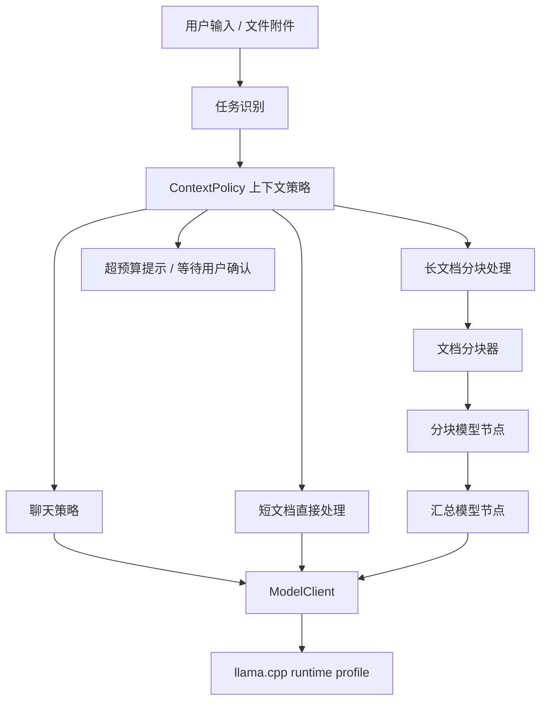

# Alita 上下文策略系统设计

## 当前状态

本设计文档已取消作为近期开发计划，不再推进“动态上下文策略系统”或“按任务自动切换上下文 profile”的实现。

取消原因：

- 用户确认不希望为了不同任务频繁重启 llama.cpp。
- 当前模型文件约几十 GB，频繁加载和卸载会反复读取硬盘、分配显存并清空显存。
- 这种方式会增加启动延迟，也可能带来显存碎片、进程残留和硬件压力。

新的近期决策：

- 第一阶段不做动态上下文切换。
- 默认用 `--ctx-size 16384` 启动本地 llama.cpp。
- 模型服务保持常驻，避免普通聊天和文档任务之间反复加载模型。
- 后续如果需要更大上下文，只允许用户在首选项里手动修改，并明确提示需要重启本地模型服务。

本文件保留为历史设计记录和后续长期参考，不作为当前执行计划来源。

## 目标

为 Alita 增加一套可复用的上下文策略系统，让 Agent 在不同任务场景下自动决定模型上下文预算、聊天历史保留方式、文档输入策略和模型运行 profile。系统目标不是简单把 `ctx-size` 调大，而是在速度、显存占用、文档长度和结果质量之间做可解释、可测试的调度。

## 背景

当前 Alita 已经具备以下能力：

- Tauri 桌面应用启动 `llama-server.exe`。
- Python sidecar 通过 OpenAI-compatible HTTP API 调用 llama.cpp。
- LangGraph 负责后台 Agent 流程编排。
- 节点流程可以读取文档、调用本地模型、导出产物。
- 当前实际启动参数为 `--ctx-size 4096`。

这个上下文长度适合普通聊天和短文本任务，但在文档分析场景下很容易不够。上下文窗口包含的不只是文档正文，还包括系统提示词、用户问题、聊天历史、工具说明、节点输入、输出预留和安全余量。因此文档稍长时，直接把全文塞进模型会导致截断、空回复、质量下降或执行失败。

## 已确认决策

- LangGraph 用于后台 Agent 流程和策略决策，不用于构建 UI。
- llama.cpp 的 `--ctx-size` 是服务启动参数，不能在单次请求里由 LangGraph 临时变大。
- 第一版继续保持本地优先。
- 上下文策略系统应该是 Agent 框架核心能力，不能写死在文档工具里。
- 聊天、文档、未来图片/音频/视频转文本后的长内容，都应复用同一套上下文策略。
- 第一阶段优先实现稳定的“预算评估 + 文档长度判断 + 安全降级”，再做多 llama.cpp profile。

## 设计原则

- **策略可解释**：每次执行前都能说明为什么选择小上下文、直接处理、分块处理或拒绝直接执行。
- **运行时边界清晰**：LangGraph 负责决策，llama.cpp runtime 负责实际模型服务能力。
- **默认不浪费显存**：普通聊天不应默认使用很大的上下文窗口。
- **文档任务不盲目塞全文**：超过预算时进入分块、摘要或后续 RAG 策略。
- **可逐步演进**：先支持单模型服务的预算策略，再扩展到多个 runtime profile。

## 推荐方案

### 方案 A：每次任务动态重启 llama.cpp

用户聊天时用小 `ctx-size`，遇到文档任务时停止当前 llama-server，然后用更大 `ctx-size` 重启。

优点：

- 只需要维护一个 llama.cpp 服务。
- UI 上容易理解当前上下文大小。

缺点：

- 重启模型慢，用户体验会中断。
- 显存释放和重新加载模型不一定稳定。
- 多任务并发时难以处理。

结论：不作为第一版默认方案，只能作为后续手动切换 profile 的兜底能力。

### 方案 B：同时运行多个 llama.cpp profile

启动多个本地模型服务，例如：

- `chat`：4096 context，低延迟聊天。
- `document`：16384 context，文档分析。
- `long_document`：32768 context，长文档或汇总任务。

LangGraph 根据任务选择对应 profile。

优点：

- 不需要频繁重启模型。
- 策略清晰，适合 Agent 自动调度。
- 可以为不同模型、量化版本和 GPU 参数建立独立 profile。

缺点：

- 显存占用高。
- 第一版实现复杂。
- 单 GPU 上同时加载多个大模型可能不可行。

结论：这是长期目标，但不适合马上作为第一阶段。

### 方案 C：先做上下文预算和分块策略，再扩展多 profile

第一阶段仍使用一个 llama.cpp 服务，但在模型调用前增加 `ContextPolicy`：

- 估算输入 token。
- 计算当前 profile 可用上下文预算。
- 普通聊天只保留必要历史。
- 短文档直接处理。
- 超预算文档进入分块摘要。
- 严重超预算时明确提示需要长文档策略，而不是让模型失败。

优点：

- 风险最低，能立即改善当前文档任务稳定性。
- 不依赖多模型进程。
- 后续可以平滑接入多个 runtime profile。

缺点：

- 单个 llama.cpp 服务的最大上下文仍受启动参数限制。
- 超长文档第一版只能分块处理，不能一次全局推理。

结论：采用方案 C 作为第一阶段，方案 B 作为第二阶段目标。

## 系统架构



## 核心模块

### ContextPolicy

`ContextPolicy` 是 Python sidecar 中的策略层，负责在模型调用前生成上下文计划。

输入：

- 任务类型：聊天、文档整理、报告生成、信息提取等。
- 当前模型 profile：`ctx_size`、推荐输出 token、是否支持长上下文。
- 用户输入文本。
- 聊天历史。
- 文档文本长度和附件元数据。
- 节点类型和工具说明预算。

输出：

- `strategy`：`chat`、`direct_document`、`chunked_document`、`reject_over_budget`。
- `runtime_profile_id`：第一版固定为当前默认 profile，第二版可选择多个 profile。
- `input_budget_tokens`：允许放入模型的输入 token 上限。
- `output_budget_tokens`：本次模型输出 token 上限。
- `history_policy`：保留最近几轮、是否摘要旧历史。
- `chunk_policy`：是否分块、每块大小、重叠大小、汇总方式。
- `reason`：给 UI 和日志使用的中文解释。

### TokenBudget

`TokenBudget` 负责把上下文窗口拆成多个预算段。

示例：

```text
ctx_size = 4096
system_prompt = 500
tool_descriptions = 400
chat_history = 500
document_input = 1800
output_reserved = 700
safety_margin = 196
```

预算公式：

```text
可用输入 = ctx_size - 系统提示词预算 - 工具说明预算 - 聊天历史预算 - 输出预留 - 安全余量
```

第一版可以使用近似估算：

- 英文和代码：按空格与标点粗略估算。
- 中文：按字符数粗略估算。
- 混合文本：取偏保守估算。

后续可以接入 llama.cpp tokenizer 或模型 tokenizer，替代粗略估算。

### RuntimeProfile

`RuntimeProfile` 描述一个模型运行 profile。

第一版只需要保存当前默认 profile：

```json
{
  "profileId": "default-local",
  "name": "默认本地模型",
  "runtime": "llama_cpp",
  "modelId": "当前默认模型",
  "ctxSize": 4096,
  "gpuLayers": "all",
  "baseUrl": "http://127.0.0.1:8766",
  "enabled": true
}
```

第二阶段扩展为多 profile：

```json
[
  {
    "profileId": "chat-fast",
    "name": "快速聊天",
    "ctxSize": 4096,
    "port": 8766
  },
  {
    "profileId": "document-standard",
    "name": "文档分析",
    "ctxSize": 16384,
    "port": 8767
  }
]
```

## LangGraph 集成方式

LangGraph 中增加一个策略节点：

```text
classify_intent -> plan_context -> route_task
```

`plan_context` 不直接调用模型，它只生成 `ContextPlan`，后续节点根据计划执行：

- 聊天：构建精简历史并调用模型。
- 短文档：全文进入模型。
- 长文档：进入分块节点。
- 超预算：生成需要用户确认或切换长上下文 profile 的消息。

这样 LangGraph 负责“什么时候用什么策略”，而不是直接管理 llama.cpp 的启动参数。

## 文档任务策略

### 短文档

条件：

- 文档估算 token 小于 `input_budget_tokens`。
- 输出预算充足。

处理方式：

- 直接读取正文。
- 构建任务提示词。
- 调用模型生成整理结果或报告。

### 中等文档

条件：

- 文档超过单次输入预算。
- 分块数量可控。

处理方式：

1. 按 token 预算切分文档。
2. 每块生成结构化摘要。
3. 汇总所有摘要。
4. 生成最终结果。

### 超长文档

条件：

- 分块数量过多。
- 单次执行成本和时间不可控。

处理方式：

- 第一版提示用户文档过长，需要启用长文档模式。
- 后续版本使用 RAG 或持久索引。

## 聊天任务策略

普通聊天不应该把全部历史都塞进模型。第一版策略：

- 保留最近 4 到 8 轮对话。
- 超过预算的历史先丢弃，不做复杂长期记忆。
- 后续增加“历史摘要节点”，把旧对话压缩成一段短摘要。
- 输出 token 默认较小，保证响应速度。

## 首选项设计

首选项中新增 `上下文` 分区。

第一阶段显示：

- 当前默认模型。
- 当前 `ctx-size`。
- 聊天输入预算。
- 文档输入预算。
- 输出 token 预留。
- 安全余量。
- 文档超预算时的处理方式：阻止直接执行 / 自动分块。

第一阶段不需要让用户编辑所有高级参数。建议只暴露：

- `上下文长度`：4096、8192、16384、32768。
- `文档超预算处理`：自动分块、提示用户确认。

当用户修改 `ctx-size` 时，需要提示：

```text
上下文长度是 llama.cpp 的启动参数，修改后需要重启本地模型服务才能生效。
```

## 工程文件与运行记录

`.alita` 工程文件不保存完整文档分块内容，只保存策略摘要和运行历史引用。

运行日志可以记录：

```json
{
  "runId": "run-uuid",
  "contextPlan": {
    "strategy": "chunked_document",
    "runtimeProfileId": "default-local",
    "ctxSize": 4096,
    "estimatedInputTokens": 12000,
    "inputBudgetTokens": 1800,
    "chunkCount": 8,
    "reason": "文档超过当前上下文预算，已使用分块整理策略。"
  }
}
```

这样后续排查失败时，可以知道 Agent 当时为什么选择某种策略。

## 错误处理

- 模型 profile 未启动：提示用户检查本地模型配置。
- 文档超过预算且未启用分块：提示用户启用分块或切换更大上下文。
- 分块数量过多：提示用户先选择部分章节或启用长文档模式。
- llama.cpp 返回空正文但包含思考内容：模型客户端自动扩大输出预算重试一次。
- 重试后仍无正文：保留节点失败状态，并在节点弹窗展示模型返回异常。
- 用户修改 `ctx-size` 后未重启：UI 显示“待重启生效”。

## 第一阶段范围

第一阶段实现：

- 新增 `ContextPolicy` 数据结构。
- 在 Python sidecar 中估算聊天和文档输入长度。
- 文档流程执行前生成 `ContextPlan`。
- 短文档直接处理。
- 超预算文档先进入明确失败提示或自动分块的基础路径。
- 将 `ContextPlan` 写入运行日志。
- 首选项显示当前 `ctx-size` 和上下文策略状态。
- 测试覆盖聊天预算、短文档、超预算文档和运行日志。

第一阶段不实现：

- 多 llama.cpp 服务同时运行。
- 真正的 RAG 索引。
- 长期记忆系统。
- 自动根据显存选择最大 ctx-size。
- UI 中复杂的高级 profile 编辑器。

## 第二阶段范围

第二阶段实现：

- 多 `RuntimeProfile` 配置。
- llama.cpp 多端口启动和健康检查。
- LangGraph 根据 `ContextPlan` 自动选择 profile。
- 用户可在首选项里创建聊天 profile 和文档 profile。
- 当显存不足时，提供 profile 启动失败原因。

## 第三阶段范围

第三阶段实现：

- 文档向量索引。
- RAG 检索。
- 长期对话摘要。
- 跨项目知识引用。
- 多模态工具输出文本后的统一上下文调度。

## 测试策略

### Python

- `ContextPolicy` 对聊天输入生成 `chat` 策略。
- 短文档生成 `direct_document` 策略。
- 超预算文档生成 `chunked_document` 或 `reject_over_budget` 策略。
- `TokenBudget` 保证输出预留和安全余量不会被文档挤占。
- 文档流程运行日志包含 `contextPlan`。

### Rust

- llama.cpp config 能保存和读取 `ctxSize`。
- 修改 `ctxSize` 后标记需要重启 runtime。
- 多 profile 阶段测试端口、参数生成和资源路径。

### 前端

- 首选项展示当前 `ctx-size`。
- 修改上下文长度时显示“需要重启生效”。
- 文档超预算时聊天区显示中文解释。
- 节点弹窗显示上下文策略摘要。

## 验收标准

- 用户能在首选项看到当前模型上下文长度。
- 文档流程执行前能生成上下文策略。
- 短文档不会因为预算判断被错误阻止。
- 超预算文档不会静默截断或直接让模型失败。
- 节点失败时能说明是上下文不足、模型空回复还是其它运行错误。
- 运行日志中能追踪每次流程使用的 `ctxSize`、估算输入 token 和策略。

## 后续开发顺序

1. 增加 `ContextPolicy` 和 `TokenBudget` 纯 Python 单元测试。
2. 在文档流程执行前接入策略生成。
3. 将策略摘要写入 run journal。
4. 前端显示当前上下文长度和策略解释。
5. 首选项增加上下文分区。
6. 支持修改 `ctx-size` 并提示重启模型服务。
7. 实现文档分块基础路径。
8. 再规划多 `RuntimeProfile`。


