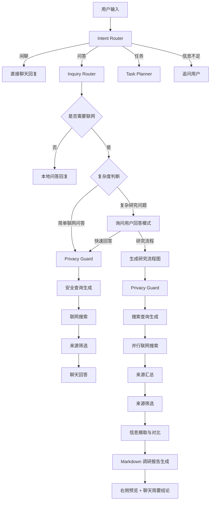
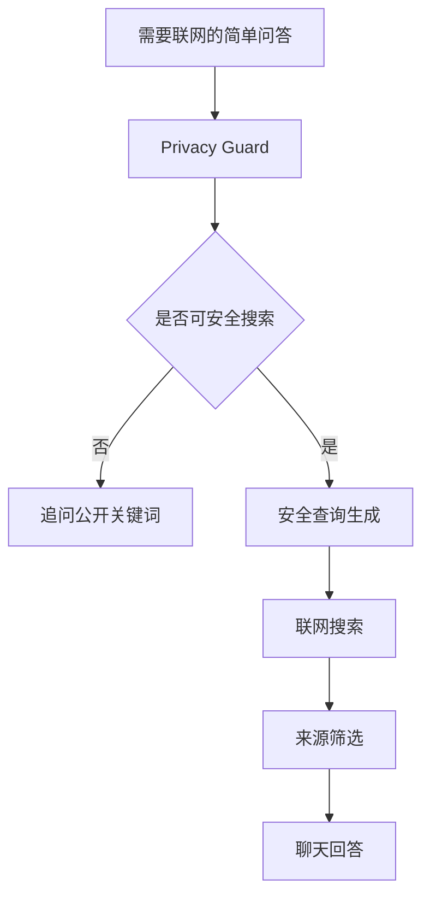
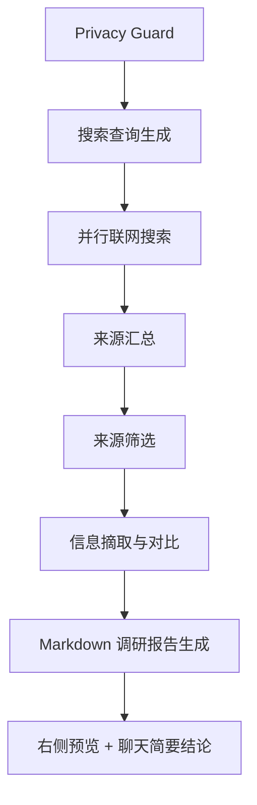

# Agent Intent And Web Research Design

## 背景

Alita 当前已经有两层 Agent 能力：

- `python/agent_service/graph.py` 使用 LangGraph 对用户消息做粗粒度分流，当前分为 `chat`、`missing_input`、`document_task`。
- `python/agent_service/execution.py` 使用自研图执行器运行已经生成的节点图，支持拓扑排序、节点事件流、失败停止、取消、从失败节点重试和从指定节点重跑。

这份设计定义下一阶段的 Agent 顶层算法：用户输入后，系统先判断用户是闲聊、问答、任务，还是信息不足；其中问答类再判断是否需要联网，简单联网问答自动快速回答，复杂联网研究先询问用户是否生成研究流程图和 Markdown 调研报告。

## 目标

- 把用户输入的第一层决策从关键词判断升级为结构化 Intent Router。
- 将“闲聊”和“问答”分开，避免所有非任务输入都走同一条聊天路径。
- 问答类支持自动判断是否需要联网。
- 简单联网问答默认自动搜索并在聊天里回答。
- 复杂联网研究先询问用户回答模式。
- 复杂研究模式生成可见流程图，并输出 Markdown 调研报告到右侧预览区。
- 自动联网前必须经过隐私安全过滤，避免泄露本地路径、文件全文、工程内部状态和其他敏感信息。

## 非目标

- 这份设计不实现 Task Planner 的任务拆解算法。
- 这份设计不定义具体搜索供应商 API。
- 这份设计不要求第一版支持 PDF 研究报告输出。
- 这份设计不改变现有文档处理节点图的执行语义。

## 顶层流程



## Intent Router

Intent Router 是用户输入进入 Agent 后的第一层判断。它输出结构化结果，后续节点不应该依赖一段自然语言解释来决定流程。

第一版意图类型：

| intent | 含义 | 默认动作 |
|---|---|---|
| `chat` | 闲聊、表达想法、轻量讨论 | 直接聊天回复 |
| `inquiry` | 用户在询问问题、请求解释、请求建议、请求调研 | 进入 Inquiry Router |
| `task` | 用户要求软件完成具体任务 | 进入 Task Planner |
| `need_input` | 用户想完成任务，但缺少必要信息 | 追问用户补充 |

建议输出结构：

```json
{
  "intent": "inquiry",
  "confidence": 0.88,
  "reason": "用户询问开源框架选型，需要回答问题而不是立即执行本地文件任务",
  "next_action": "route_inquiry"
}
```

低置信度时不直接执行高风险动作。对于闲聊和普通问答，可以倾向继续回答；对于任务和联网研究，如果关键信息不足，应转为 `need_input`。

## Inquiry Router

Inquiry Router 只处理 `intent = inquiry` 的输入。它需要判断：

- 是否需要联网。
- 如果需要联网，是简单联网问答还是复杂联网研究。

### 需要联网的情况

以下问题默认需要联网：

- 最新信息、版本、价格、新闻、发布时间、维护状态。
- GitHub 仓库、开源项目成熟度、star、release、issue 活跃度。
- 官方文档、标准、法规、政策、论文、模型页面。
- 用户明确要求“搜索”、“联网”、“查一下”、“去 GitHub 找”。
- 模型不确定，且需要可靠来源支撑。

以下问题默认不联网：

- 当前项目代码、当前软件状态、用户已经提供的本地上下文。
- 通用概念解释，且不依赖最新事实。
- 已经足够由当前对话上下文回答的问题。

### 简单和复杂的分流

简单联网问答：

- 单一事实、版本、状态、链接、数量。
- 目标窄，少量来源即可回答。
- 例子：“Plyr 最新版本是多少？”、“某个 GitHub 项目还维护吗？”

复杂联网研究：

- 需要比较多个方案。
- 需要架构建议或选型建议。
- 要求寻找成熟框架、最佳实践、技术路线。
- 需要输出报告、文档、方案。
- 预期需要多个查询词和交叉验证。

复杂研究问题不直接搜索，而是询问用户模式：

```text
这个问题需要比较系统的联网调研。你希望我：

A. 快速检索后直接在聊天里回答
B. 生成研究流程图，记录搜索网站、筛选过程，并输出 Markdown 调研报告
```

## Privacy Guard

Privacy Guard 是所有联网路径的硬性前置节点。自动联网可以执行，但不能默认把本地隐私内容、完整文件内容、完整工程路径发送到搜索引擎。

默认禁止发送：

- 本地完整路径，例如 `D:\...`、`C:\Users\...`。
- 文件全文、附件全文、长段落原文。
- 个人信息，例如手机号、邮箱、身份证、家庭地址。
- 公司、客户、合同、财务、私有仓库等敏感上下文。
- `.alita` 工程内部状态、运行日志、用户首选项路径、模型路径。
- 私有文档内容，除非用户明确指定可公开关键词。

允许发送：

- 公开技术关键词，例如 `LangGraph`、`PhotoSwipe`、`Plyr`、`Qwen3-ASR-1.7B`。
- 去隐私化后的问题摘要。
- 已公开的 URL、GitHub 仓库名、论文名、产品名。

Privacy Guard 输出结构：

```json
{
  "blocked": false,
  "safe_query_seed": "React Tauri local video preview open source framework",
  "removed_sensitive_items": ["local_path", "private_project_name"],
  "reason": "移除了本地路径和私有项目上下文，保留公开技术关键词"
}
```

如果无法生成安全搜索词：

```json
{
  "blocked": true,
  "safe_query_seed": "",
  "removed_sensitive_items": ["local_file_content"],
  "reason": "问题主要由本地私有内容构成，无法安全联网搜索",
  "next_action": "ask_user_for_public_keywords"
}
```

## 简单联网问答模式

简单联网问答不生成复杂流程图，默认自动执行：



聊天回答应当简洁，必要时附来源链接。它不生成 Markdown 调研报告，不占用右侧预览区。

## 复杂研究流程模式

复杂研究流程模式会生成可见节点图。图上保持清爽，不把每个查询词都展开为独立节点。

节点序列：

1. `privacy-guard`: 隐私安全过滤。
2. `search-query-generate`: 搜索查询生成。
3. `parallel-web-search`: 并行联网搜索。
4. `source-aggregate`: 来源汇总。
5. `source-filter`: 来源筛选。
6. `information-synthesis`: 信息摘取与对比。
7. `markdown-report-generate`: Markdown 调研报告生成。
8. `research-output`: 输出 artifact 并在聊天给简要结论。



### 并行联网搜索节点

图上只显示一个“并行联网搜索”节点，内部可并行执行多个查询词。

内部状态示例：

```json
{
  "node_id": "parallel-web-search",
  "internal_tasks": [
    {
      "query": "React image viewer open source PhotoSwipe alternatives GitHub",
      "status": "completed",
      "attempts": 1,
      "result_count": 8,
      "cached_result_ref": "search-result-1"
    },
    {
      "query": "React video player open source Plyr Video.js comparison",
      "status": "running",
      "attempts": 1,
      "result_count": 0
    }
  ]
}
```

失败处理：

- 每个查询最多执行 3 次：首次执行 + 2 次重试。
- 重试之间使用递增等待，例如 1 秒、3 秒。
- 所有查询成功后进入来源汇总。
- 任一查询重试后仍失败，则 `parallel-web-search` 节点失败，研究流程停止。

用户点击重试时：

- 只重试失败查询。
- 复用已经成功的查询结果。
- 成功后合并新旧结果，继续来源汇总和后续节点。

这要求节点运行记录保存 `internal_tasks` 或等价结构，而不仅仅保存节点级 `completed/failed`。

## 来源筛选

来源筛选按问题类型动态排序，但始终优先正规、官方、可追溯来源。

默认优先级：

| 问题类型 | 优先来源 |
|---|---|
| 技术框架/开源项目 | 官方文档、GitHub 仓库、npm/PyPI/crates.io、维护者博客 |
| 软件库成熟度判断 | GitHub、官方文档、release/changelog、issue/PR 活跃度 |
| 模型/论文/AI 技术 | 官方模型页、论文、Hugging Face、GitHub、机构博客 |
| 法规/政策/合规 | 政府官网、法规数据库、官方公告 |
| 新闻/近期事件 | 权威媒体、官方公告、公司新闻稿 |
| 产品价格/规格 | 厂商官网、官方文档、官方商城 |
| 普通知识 | 百科类来源可辅助，但不作为唯一依据 |

通用规则：

- 优先官方来源。
- 同一事实尽量至少两个来源交叉验证。
- SEO 聚合站、搬运站、低质量博客默认降权。
- Reddit、论坛、社区评论可以作为用户反馈，但不能作为权威事实。
- 如果只找到非官方来源，回答和报告中必须说明可信度限制。
- 如果来源冲突，优先官方、最新、可追溯来源，并说明冲突。

来源筛选输出：

```json
{
  "question_type": "technical_framework_selection",
  "accepted_sources": [
    {
      "url": "https://github.com/videojs/video.js",
      "source_type": "github_repository",
      "reliability": "high",
      "reason": "官方仓库，维护状态和社区指标可验证"
    }
  ],
  "rejected_sources": [
    {
      "url": "https://example-seo-listicle.com",
      "reason": "聚合文章，缺少原始证据"
    }
  ]
}
```

## Markdown 调研报告

复杂研究模式默认输出 Markdown 文档。第一版不默认生成 PDF。

默认路径：

```text
artifacts/research/research-report-<short-id>.md
```

报告结构：

```markdown
# 调研报告标题

## 简要结论
用 3-6 条要点先回答用户最关心的问题。

## 问题与边界
说明用户问题、安全摘要、这次调研覆盖什么、不覆盖什么。

## 检索范围
列出搜索时间、搜索查询词、问题类型、检索边界。

## 采用的来源
| 来源 | 类型 | 采用原因 |
|---|---|---|

## 被排除的来源
| 来源 | 排除原因 |
|---|---|

## 研究过程
说明对比、归纳、交叉验证、冲突处理。

## 完整结论与建议
给出最终判断、推荐方案、风险、下一步行动。

## 来源链接
列出引用链接。
```

报告必须列出采用来源和被排除来源。被排除来源保持简洁，只说明排除原因。

## 研究完成后的聊天回复

复杂研究流程完成后，聊天里不贴完整报告。聊天只给简要结论，并提示右侧预览区有完整文档。

示例：

```text
调研完成。简要结论：

1. ...
2. ...
3. ...

完整调研报告已经生成在右侧预览区，里面包含检索范围、采用来源、被排除来源、研究过程和完整建议。
```

建议事件：

```json
{
  "type": "research.completed",
  "payload": {
    "artifactId": "research-report-xxxx",
    "summary": ["结论 1", "结论 2", "结论 3"],
    "sourceCount": 8,
    "excludedSourceCount": 5
  }
}
```

## 数据和事件扩展建议

第一版实现可以尽量复用现有 `AgentEvent`、`GraphNode`、`NodeRunRecord` 和 `RunJournal`。

建议扩展点：

- `GraphNode.nodeType` 增加研究相关节点类型，或者继续使用 `fixed_tool` / `model` 并通过 `toolRef` 区分。
- `NodeRunRecord` 增加可选 `values` 字段透传到前端，便于节点详情展示搜索查询、来源数量和内部子任务状态。
- `RunJournal` 保存 `parallel-web-search` 的 `internal_tasks`，用于失败后只重试失败查询。
- 新增 `research.completed` 事件，或者用现有 `message.created` + `artifact.created` 组合表达完成状态。

## 第一阶段验收标准

- 闲聊输入不生成图，直接回复。
- 本地项目问答不联网，直接基于项目上下文回答。
- 简单联网问答自动经过 Privacy Guard、搜索、来源筛选，并在聊天里回答。
- 复杂联网研究会先询问用户选择快速回答或研究流程。
- 选择研究流程后生成可见流程图。
- 研究流程的并行搜索节点内部支持多个查询并行。
- 并行查询失败会自动重试，重试后仍失败则节点失败。
- 用户重试时只重试失败查询，成功结果被复用。
- Markdown 报告生成到 artifact，右侧可预览。
- 报告包含简要结论、检索范围、采用来源、被排除来源、研究过程、完整结论与建议、来源链接。
- 自动联网不会发送本地完整路径、文件全文、工程内部状态、模型路径、用户首选项路径或其他敏感信息。

## 后续阶段

这份设计完成后，下一阶段应继续细化 Task Planner：

- 用户任务如何拆分成节点。
- 哪些任务需要先展示图等待确认。
- 哪些任务可以自动执行。
- 任务节点如何选择工具、模型和输出 artifact。
- 任务执行中的人工确认、权限申请、失败恢复和回滚策略。
