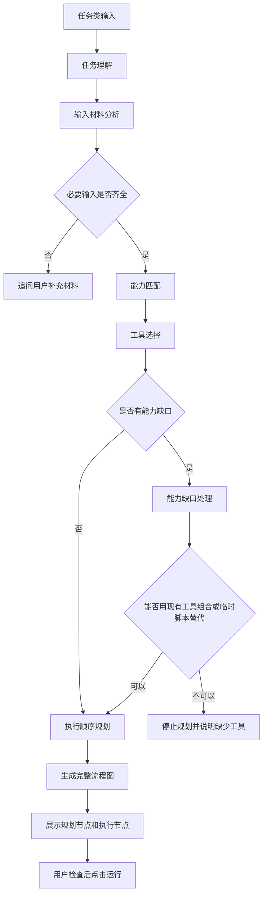
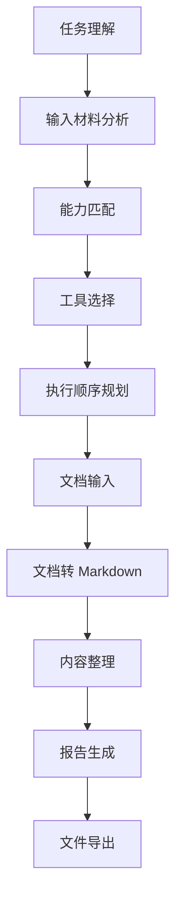
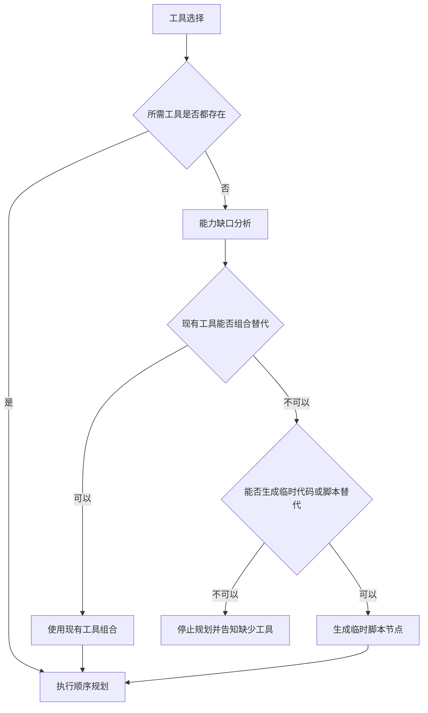
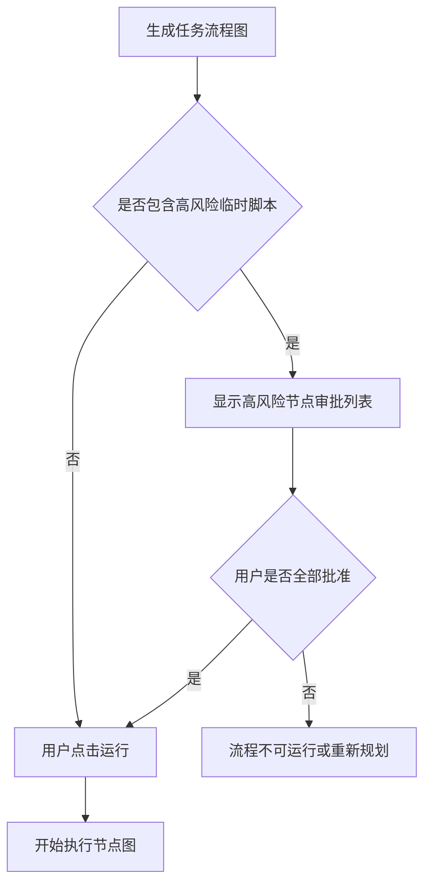
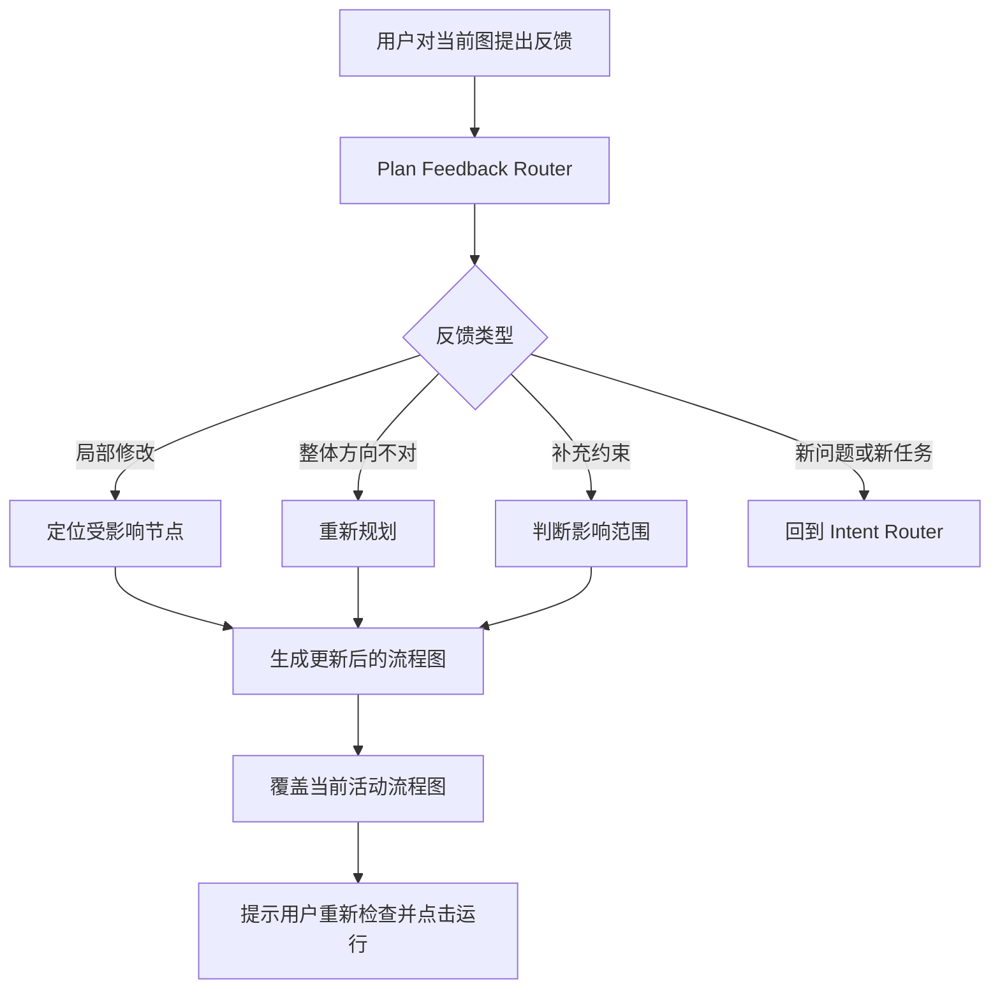
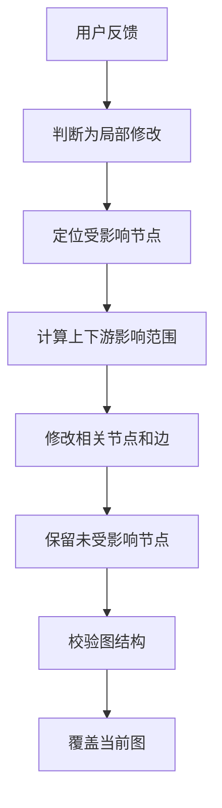

# Task Planner Design

## 背景

上一阶段设计已经定义了 Agent 顶层入口：

- `chat`: 闲聊，直接回复。
- `inquiry`: 问答，必要时联网搜索或生成研究流程。
- `task`: 用户要求软件完成具体任务。
- `need_input`: 任务信息不足，追问用户。

这份设计定义 `task` 路径的第一版算法。Task Planner 的目标不是立即执行任务，而是先理解任务、分析输入、匹配能力、选择工具、规划执行顺序，然后生成用户可审查的完整节点图。用户确认并点击运行后，执行器才运行执行节点。

当前代码已有基础能力：

- 前端和 `.alita` 工程支持保存 `NodeGraph`。
- Python sidecar 已有 `run_graph_events` 执行器。
- 节点支持 `fixed_tool`、`model`、`output`、`temporary_placeholder` 等类型。
- 节点已有 `scriptReview` 字段，可作为后续临时脚本审核能力的基础。

## 目标

- Task Planner 在任务类输入后生成完整、可解释、可审查的流程图。
- 流程图同时包含规划分析节点和真正执行节点。
- 任务图生成后必须先展示给用户，用户点击运行后才执行。
- 规划分析节点保存进 `.alita` 工程，但运行时不重新执行。
- 工具选择优先使用软件内置或官方集成工具。
- 缺少工具时，先尝试现有工具组合，再判断能否生成临时脚本。
- 低风险临时脚本可自动执行，但必须透明显示代码预览和权限摘要。
- 高风险临时脚本必须在运行前集中审批。
- 用户对流程图的反馈要先判断是局部修改、整体重规划、补充约束还是新任务。
- 每个节点都附带预计耗时和资源占用。
- 实际耗时超过预计时，节点显示“耗时超出预计”提示。

## 非目标

- 这份设计不实现图上手动拖拽编辑工具和节点参数。
- 这份设计不实现完整图版本历史。
- 这份设计不要求第一版支持高风险脚本沙箱执行细节。
- 这份设计不替换现有文档处理执行器，而是定义后续扩展方向。

## 总体流程



## 规划分析节点

Task Planner 生成的流程图必须显示规划过程本身。规划节点让用户看到 Agent 为什么这样拆任务、为什么选择这些工具、为什么按这个顺序执行。

规划节点包括：

1. `task-understanding`: 任务理解。
2. `input-analysis`: 输入材料分析。
3. `capability-matching`: 能力匹配。
4. `tool-selection`: 工具选择。
5. `execution-planning`: 执行顺序规划。

规划节点特点：

- 在生成流程图时已经完成，状态为 `completed`。
- 保存进 `.alita` 工程。
- 用户点击运行后不重新执行。
- 执行器不应对规划节点发出 `node.running` 事件。
- 节点详情展示结构化分析结果。

示例：



### 任务理解节点

输出结构：

```json
{
  "task_type": "document_report_generation",
  "goal": "把用户上传的文档整理成报告",
  "expected_output": "Markdown 报告",
  "constraints": ["中文", "结构清晰"]
}
```

### 输入材料分析节点

输出结构：

```json
{
  "available_inputs": ["document_file"],
  "missing_inputs": [],
  "input_types": ["docx"],
  "input_count": 1
}
```

如果缺少必要输入，Task Planner 不生成可运行执行图，应追问用户。

### 能力匹配节点

输出结构：

```json
{
  "required_capabilities": [
    "document_to_markdown",
    "content_summarization",
    "report_generation",
    "artifact_export"
  ]
}
```

### 工具选择节点

输出结构：

```json
{
  "selected_tools": [
    {
      "tool_ref": "document.markitdown_convert",
      "reason": "需要把 DOCX 或 PDF 转换为 Markdown"
    }
  ],
  "selected_models": [
    {
      "model_ref": "agent_llm",
      "reason": "需要摘要、整理和报告撰写"
    }
  ],
  "missing_capabilities": []
}
```

### 执行顺序规划节点

输出结构：

```json
{
  "execution_order": [
    "document-input",
    "document-parse",
    "content-organize",
    "report-generate",
    "file-export"
  ],
  "reason": "先获取附件，再转换为文本，再由模型生成报告，最后导出 artifact"
}
```

## 用户确认后执行

任务流程图生成后，总是先展示给用户。用户点击运行后才执行。

聊天提示示例：

```text
我已经为这个任务生成了执行流程图。请先检查右侧节点顺序、工具选择和输出产物；确认无误后点击“运行”。
```

执行规则：

- 规划节点不执行。
- 执行节点按依赖关系运行。
- 高风险临时脚本必须在运行前完成审批。
- 如果审批未完成，运行按钮应不可用或触发审批面板。

## 工具选择优先级

同一能力有多个可用工具时，优先使用软件内置或官方集成工具。

优先级：

1. 用户在首选项中明确指定的默认工具，前提是健康检查通过。
2. 软件内置或官方集成工具。
3. 已安装且经过验证的工具包。
4. 多个现有工具组合方案。
5. 低风险临时脚本。
6. 高风险临时脚本。
7. 停止规划，提示缺少能力。

如果用户没有偏好，默认选择内置或官方集成工具。

工具选择记录：

```json
{
  "capability": "document_to_markdown",
  "selected_tool": "document.markitdown_convert",
  "selection_reason": "软件内置文档转换工具，支持当前输入类型",
  "fallback_tools": [],
  "requires_permission": false
}
```

## 能力缺口处理

当任务需要某个能力但当前软件没有对应工具时，Task Planner 进入 Capability Gap Resolver。



判断顺序：

1. 优先查找现有工具是否能直接完成。
2. 判断多个现有工具组合是否能完成。
3. 判断是否可以生成临时脚本替代。
4. 如果不可替代，停止规划并告诉用户缺少工具。

不可替代时，回复应包含：

- 缺少的能力。
- 当前工具库为什么无法完成。
- 为什么不能安全生成临时脚本。
- 可选下一步，例如安装工具、添加工具包、调整任务目标。

## 临时脚本节点

临时脚本节点用于补足当前工具库缺失的小范围能力。它必须进入流程图，并展示代码预览和权限摘要。

建议节点类型：

```text
temporary_script
```

示例：

```json
{
  "nodeType": "temporary_script",
  "displayName": "临时图片批量压缩脚本",
  "replaces_missing_capability": "image_batch_compression",
  "status": "ready",
  "riskLevel": "low",
  "scriptReview": {
    "status": "approved_low_risk",
    "summary": "读取用户选择的图片并输出压缩副本，不覆盖原文件。",
    "permissions": [
      "read:selected_attachments",
      "write:project_artifacts"
    ],
    "codePreview": "..."
  }
}
```

## 临时脚本风险分级

低风险脚本可以自动执行，但必须在节点详情中显示代码预览和权限摘要。

低风险条件：

- 只读取用户已选择的附件。
- 只写入当前项目的 `artifacts/` 目录。
- 不覆盖原文件。
- 不删除文件。
- 不访问网络。
- 不执行系统命令。
- 不修改项目源码或用户配置。
- 不读取用户目录里的任意文件。
- 输入输出路径明确。

高风险脚本必须运行前集中审批。

高风险条件：

- 删除、覆盖、移动原文件。
- 访问用户未明确选择的路径。
- 访问网络。
- 执行 shell 命令。
- 安装依赖。
- 修改源码、首选项、模型配置。
- 读取敏感目录。
- 批量处理大量文件。
- 输出到项目目录之外。
- 脚本逻辑复杂到无法简单审查。

无法判断风险时按高风险处理。

## 高风险脚本审批

如果流程图包含高风险临时脚本节点，用户点击运行前必须先集中审批。



审批面板展示：

- 节点名称。
- 替代的缺失能力。
- 脚本摘要。
- 风险等级。
- 权限列表。
- 输入文件。
- 输出位置。
- 是否会覆盖、删除、联网或执行系统命令。
- 代码预览。
- 批准或拒绝按钮。

如果用户拒绝某个高风险节点：

- 流程图不能运行。
- Task Planner 可以尝试重新规划低风险方案。
- 如果无法重新规划，应提示当前任务缺少可安全执行的能力。

## 用户反馈和流程图修改

当当前工程已有待运行或已运行流程图，用户继续在聊天中表达对流程图的意见时，Agent 进入 Plan Feedback Router。



反馈类型：

| 类型 | 示例 | 动作 |
|---|---|---|
| 局部修改 | “不要导出 PDF，只要 Markdown” | 定位受影响节点，只改局部 |
| 整体重规划 | “不是，我想做产品方案，不是总结报告” | 重新执行 Task Planner |
| 补充约束 | “输出要更适合给投资人看” | 判断影响范围，局部修改或重规划 |
| 新问题/新任务 | “顺便查一下这个库是否维护” | 回到 Intent Router |

## 覆盖规则

第一版不做完整图版本历史。用户反馈生成新图后，默认覆盖当前活动图。

规则：

- 未运行过的待确认流程图：可以直接覆盖。
- 已经运行过并生成 `runHistory` 或 artifact 的流程图：覆盖前必须询问用户确认。

确认提示：

```text
当前流程图已经运行过，并生成了运行记录或产物。修改后会覆盖当前画布上的流程图，但已有运行历史和 artifact 会保留。是否确认覆盖？
```

确认覆盖后：

- 当前 `graph` 被替换为新图。
- 旧的 `runHistory` 保留。
- 已有 `artifactRefs` 保留。
- 新图需要用户重新点击运行。

## 局部修改

Plan Feedback Router 判断为局部修改时，只改受影响节点，保留其他节点。



局部修改输出摘要：

```json
{
  "feedback_type": "local_patch",
  "changed_nodes": ["typst-export", "file-export", "tool-selection", "execution-planning"],
  "removed_nodes": ["typst-export"],
  "unchanged_nodes": ["document-input", "document-parse", "content-organize", "report-generate"],
  "reason": "用户要求只生成 Markdown，不再导出 PDF"
}
```

修改后必须校验：

- 没有悬空依赖。
- 没有循环。
- 每个执行节点依赖满足。
- 输出节点仍存在。
- 工具引用有效。
- 高风险临时脚本审批状态仍然有效或已被撤销。

## 脚本审批状态变更

如果用户反馈导致已批准的高风险临时脚本节点发生变化，是否重新审批由 Agent 判断，但必须遵守严格规则。

必须重新审批：

- 脚本代码发生实质变化。
- 权限范围变大。
- 新增网络访问、shell 命令、删除、覆盖、外部路径写入。
- 输入范围扩大。
- 输出范围改变到项目外。
- 风险等级升高。
- 依赖或运行环境发生变化。

可以保留批准：

- 只改节点名称、说明文字。
- 只改无执行影响的展示字段。
- 权限不变，代码不变，输入输出范围不变。
- 只调整图上位置或边的布局。

保留批准记录：

```json
{
  "approvalStatus": "preserved",
  "approvalPreservedReason": "仅调整节点说明，脚本代码、权限和输入输出范围未变化"
}
```

撤销批准记录：

```json
{
  "approvalStatus": "revoked",
  "approvalRevokedReason": "脚本新增了外部路径写入权限"
}
```

低风险脚本如果修改后风险升高，必须从自动执行转为高风险审批。

## 预计耗时和资源占用

Task Planner 必须为每个节点附带预计耗时和资源占用。

字段建议：

```json
{
  "estimatedDuration": {
    "label": "约 1-3 分钟",
    "minSeconds": 60,
    "maxSeconds": 180,
    "confidence": "medium",
    "reason": "输入文档约 80 页，需要模型生成摘要"
  },
  "resourceEstimate": {
    "cpu": "medium",
    "memory": "medium",
    "gpu": "high",
    "disk": "low",
    "network": "none",
    "reason": "本地 LLM 节点会占用 GPU，文档转换主要占用 CPU"
  }
}
```

资源维度：

```text
cpu: none / low / medium / high
memory: none / low / medium / high
gpu: none / low / medium / high
disk: none / low / medium / high
network: none / low / medium / high
```

节点卡片可显示：

```text
约 1-3 分钟 · GPU 高
```

节点详情显示完整原因。

## 耗时超出预计提示

执行时如果实际耗时明显超过预计，节点应显示“耗时超出预计”。

规则：

- 每个节点运行时记录 `startedAt`。
- 如果当前耗时超过预计上限，更新节点运行提示。
- 如果预计是区间，例如 `1-3 分钟`，超过 3 分钟提示。
- 如果预计是 `少于 10 秒`，超过 10 秒提示。
- 如果没有明确上限，只显示 elapsed time，不提示超时。

运行提示结构：

```json
{
  "nodeId": "report-generate",
  "status": "running",
  "runtimeNotice": {
    "type": "duration_exceeded_estimate",
    "message": "耗时已超过预计 1-3 分钟，可能是输入较大或模型响应较慢。",
    "elapsedSeconds": 245,
    "estimatedMaxSeconds": 180
  }
}
```

前端节点卡片可显示：

```text
运行中 · 已 4:05 · 超出预计
```

运行历史应保存该提示，便于后续优化估算。

## 数据结构扩展建议

建议扩展 `GraphNode`：

```ts
type NodeType =
  | "planning"
  | "fixed_tool"
  | "model"
  | "output"
  | "temporary_script"
  | "temporary_placeholder";
```

建议为节点增加：

```ts
type NodeEstimate = {
  estimatedDuration?: {
    label: string;
    minSeconds?: number;
    maxSeconds?: number;
    confidence: "low" | "medium" | "high";
    reason?: string;
  };
  resourceEstimate?: {
    cpu: "none" | "low" | "medium" | "high";
    memory: "none" | "low" | "medium" | "high";
    gpu: "none" | "low" | "medium" | "high";
    disk: "none" | "low" | "medium" | "high";
    network: "none" | "low" | "medium" | "high";
    reason?: string;
  };
};
```

建议扩展 `ScriptReviewState`：

```ts
type ScriptReviewState = {
  status:
    | "not_reviewed"
    | "approved_low_risk"
    | "approved_by_user"
    | "rejected"
    | "revoked";
  riskLevel: "low" | "high" | "unknown";
  summary: string;
  permissions: string[];
  codePreview?: string;
  approvalPreservedReason?: string;
  approvalRevokedReason?: string;
};
```

## 第一阶段验收标准

- 任务类输入生成包含规划节点和执行节点的完整流程图。
- 流程图生成后不自动运行，必须用户点击运行。
- 规划节点保存到 `.alita` 工程。
- 运行时不重新执行规划节点。
- 工具选择优先内置或官方集成工具。
- 缺少工具时先尝试现有工具组合，再判断临时脚本。
- 无法替代时停止规划并说明缺少能力。
- 低风险临时脚本可自动执行，但显示代码预览和权限摘要。
- 高风险临时脚本必须运行前集中审批。
- 用户反馈能被路由为局部修改、整体重规划、补充约束或新问题。
- 未运行图可直接覆盖；已运行图覆盖前必须确认。
- 局部修改只改受影响节点，并校验图结构。
- 已批准脚本如代码或权限发生实质变化，必须重新审批。
- 每个节点显示预计耗时和资源占用。
- 节点运行超过预计上限时显示“耗时超出预计”。

## 后续阶段

Task Planner 设计确认后，下一步应进入实现计划，重点拆分为：

- 数据结构扩展。
- 规划节点图生成。
- 执行器过滤 planning 节点。
- 临时脚本风险模型。
- 高风险审批 UI。
- Plan Feedback Router。
- 节点耗时和资源估算展示。
