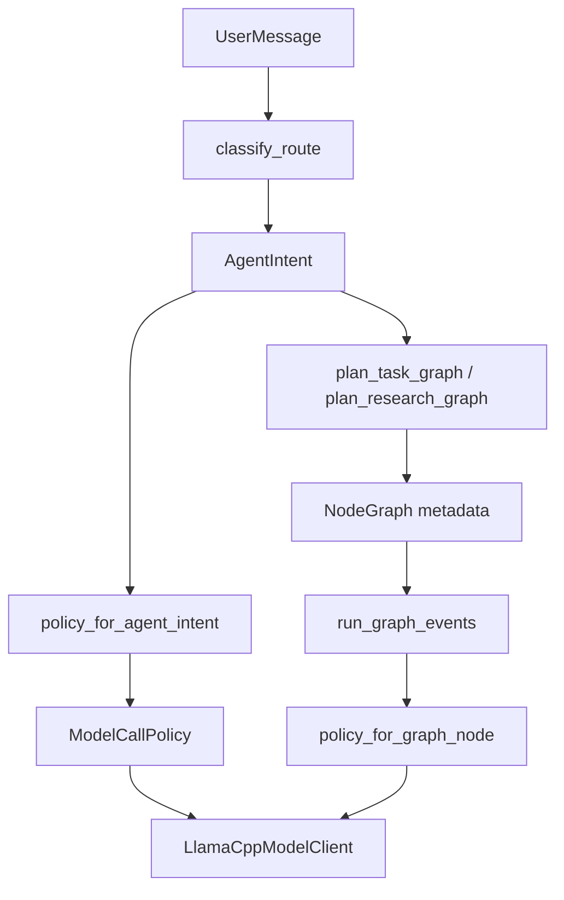

# Model Call Policy Design

## Purpose

Alita already routes user messages through a LangGraph entry flow that classifies intent and decides whether the request is chat, local inquiry, web inquiry, missing input, or a task graph. The missing layer is a model-call policy that translates that route decision into concrete llama.cpp request behavior.

This design adds a small policy boundary between route classification and model invocation. Simple chat should use a fast profile. Complex task planning, research flows, and graph model nodes should use deeper reasoning profiles with larger token budgets and model-specific thinking options when the runtime supports them.

## Current Runtime Reality

The current shipped `main` runtime has the relevant pieces in place:

- `python/agent_service/graph.py` classifies messages with `classify_route()` and `parse_goal_spec()`, then routes them through `StateGraph`.
- `python/agent_service/intent.py` returns `chat`, `inquiry`, `task`, or `need_input`, with local, simple web, and complex web inquiry modes.
- `python/agent_service/model_client.py` calls llama.cpp through the OpenAI-compatible `/v1/chat/completions` endpoint.
- `python/agent_service/model_runtime.py` executes graph model nodes through `ModelBinding.temperature` and `ModelBinding.max_tokens`.
- `python/agent_service/task_planner.py` builds task graphs with planning, model, fixed-tool, output, and temporary-script nodes.
- `python/agent_service/execution.py` chooses `DocumentFlowExecutor`, `PlannedTaskExecutor`, or `ResearchFlowExecutor` for graph execution.

The current model client accepts only `temperature`, `max_tokens`, `stream`, and `messages`. It detects a `reasoning_content` token-budget exhaustion shape only to retry with more tokens. It does not expose first-class policy names, thinking controls, or per-route defaults.

## Goals

1. Preserve the existing LangGraph route shape and add a policy resolver after route classification.
2. Give simple chat a fast model profile.
3. Give complex tasks, research flow creation, and graph model nodes a deep reasoning profile.
4. Keep Qwen-specific thinking controls isolated inside the model client adapter.
5. Keep existing call sites compatible while allowing new call sites to pass a policy object.
6. Add tests that prove route decisions choose the correct model policy.

## Non-Goals

The first implementation should not add a visible UI switch for fast, normal, or deep mode. It should not expose model chain-of-thought text in the app. It should not require a specific llama.cpp version to accept Qwen-specific fields. Unsupported fields must degrade safely to plain OpenAI-compatible payloads with adjusted token budgets and prompts.

## Proposed Architecture

The new layer is `python/agent_service/model_policy.py`.

It owns:

- `ModelCallProfile`: stable profile names used by app logic.
- `ModelCallPolicy`: concrete request settings for a model call.
- `policy_for_agent_intent()`: maps LangGraph `AgentIntent` to a policy.
- `policy_for_graph_node()`: maps a `GraphNode` and graph metadata to a policy.
- `apply_policy_defaults()`: merges explicit legacy call parameters with policy defaults.

The model client owns runtime adaptation:

- Build the OpenAI-compatible payload.
- Add supported extra body fields for thinking only when configured.
- Ignore unsupported extra fields by default unless tests use a strict fake transport.
- Continue extracting only final `content` for user-visible answers.

The graph layer owns selection:

- `chat` and `local_inquiry` use `FAST_CHAT`.
- `web_simple_inquiry` uses `FAST_FACTUAL`.
- `web_complex_choice` uses `FAST_FACTUAL`, because it only asks the user to choose between quick answer and research flow.
- `web_complex_research_flow` and `task` use `DEEP_REASONING` for graph planning.

The execution layer owns graph-node selection:

- Document report model nodes use `NODE_REASONING`.
- Generic planned model nodes use `NODE_REASONING`.
- Research report synthesis uses `DEEP_REASONING`.
- Research report quality check uses `NODE_REASONING`.

## Policy Profiles

### FAST_CHAT

Use for ordinary conversation and local inquiry.

- `temperature`: `0.3`
- `max_tokens`: `768`
- `stream`: `true` for streaming chat
- `thinking`: `off`
- `preserve_thinking`: `false`
- Intended effect: low latency and concise answers.

### FAST_FACTUAL

Use for simple factual web answers and simple route follow-up prompts.

- `temperature`: `0.2`
- `max_tokens`: `1024`
- `stream`: `false` or caller controlled
- `thinking`: `auto`
- `preserve_thinking`: `false`
- Intended effect: enough reasoning for source synthesis without turning every answer into a deep planning run.

### DEEP_REASONING

Use for task graph planning and complex research flow work.

- `temperature`: `0.2`
- `max_tokens`: `8192`
- `stream`: `false`
- `thinking`: `deep`
- `preserve_thinking`: `true`
- Intended effect: reserve budget for Qwen thinking and improve multi-step task decomposition.

### NODE_REASONING

Use for executable graph model nodes.

- `temperature`: `0.2`
- `max_tokens`: `4096`
- `stream`: `false`
- `thinking`: `auto`
- `preserve_thinking`: `true`
- Intended effect: stable node output without using the largest planning budget for every node.

## Data Model

The initial policy model should be plain Python data and not a Pydantic API schema.

```python
from dataclasses import dataclass
from enum import Enum
from typing import Literal

ThinkingMode = Literal["off", "auto", "deep"]


class ModelCallProfile(str, Enum):
    FAST_CHAT = "fast_chat"
    FAST_FACTUAL = "fast_factual"
    DEEP_REASONING = "deep_reasoning"
    NODE_REASONING = "node_reasoning"


@dataclass(frozen=True)
class ModelCallPolicy:
    profile: ModelCallProfile
    temperature: float
    max_tokens: int
    thinking: ThinkingMode
    preserve_thinking: bool = False
    stream: bool | None = None
```

The policy model intentionally stays backend agnostic. The llama.cpp adapter derives
runtime request fields from `thinking` and `preserve_thinking` so Qwen-specific
payload keys do not leak into LangGraph, task planner, or graph execution code.

## llama.cpp And Qwen Thinking Adaptation

The model client should treat thinking as a best-effort runtime feature.

When `thinking == "off"`:

- Prefer an extra request flag that disables thinking if the active llama.cpp build supports it.
- Add a compact system instruction that asks for direct answers.
- Keep token budget small.

When `thinking == "deep"`:

- Prefer extra request fields that enable thinking and preserve thinking if supported.
- Increase `max_tokens`.
- Add a planning-oriented system instruction only at the call site where appropriate.

If llama.cpp rejects unknown thinking request fields with a request-validation
error, the adapter should retry once without those derived fields and keep the
larger token budget. This gives reliable behavior across llama.cpp versions
without masking network or server failures.

## Integration Points

### `graph.py`

`answer_with_model()` should accept or resolve a policy. Streaming chat should resolve a policy before calling `client.stream_chat()`.

Complex graph creation can initially remain deterministic in `task_planner.py` and `web_research.py`. The route still records a deep policy in metadata so future model-assisted planners can consume it without changing the graph contract.

### `model_client.py`

`chat()` and `stream_chat()` should accept `policy: ModelCallPolicy | None = None`.

Legacy arguments remain supported:

```python
client.chat(messages, temperature=0.2, max_tokens=1024)
```

New policy calls prefer:

```python
client.chat(messages, policy=DEEP_REASONING_POLICY)
```

If both are provided, explicit `temperature` and `max_tokens` override policy defaults. This keeps existing tests and call sites predictable.

### `model_runtime.py`

`ModelRuntime.run()` should choose `NODE_REASONING` by default, then merge `ModelBinding.temperature` and `ModelBinding.max_tokens` as explicit overrides. This preserves node-specific bindings while making graph execution policy-aware.

### `execution.py`

`PlannedTaskExecutor` and `ResearchFlowExecutor` should call model client methods with explicit policies for planned model nodes and research synthesis nodes.

### Frontend And API

No frontend schema change is required in the first implementation. The backend can emit existing events. A later UI pass may display `graph.metadata.modelPolicy` or a runtime notice, but the first version should avoid changing user-facing behavior beyond latency and output quality.

## Data Flow



## Error Handling

If a policy-derived thinking field causes llama.cpp to reject a request, retry
once without policy-specific extra fields and preserve the resolved `temperature`
and `max_tokens`.

If the retry fails, raise the existing `ModelRuntimeRequestFailed` error. The graph runner already converts model failures into `node.failed`, `task.failed`, and `graph.patch_suggested` events.

If a caller passes an unknown profile name, the resolver should fail fast in tests and use `FAST_CHAT` only for explicit fallback code paths. Runtime application code should not create ad hoc profile names.

## Test Plan

Add focused tests before implementation:

- `python/tests/test_model_policy.py`
  - `chat` maps to `FAST_CHAT`.
  - `local_inquiry` maps to `FAST_CHAT`.
  - `web_simple_inquiry` maps to `FAST_FACTUAL`.
  - `web_complex_research_flow` maps to `DEEP_REASONING`.
  - `task` maps to `DEEP_REASONING`.
  - research synthesis graph node maps to `DEEP_REASONING`.
  - ordinary model graph node maps to `NODE_REASONING`.

- `python/tests/test_model_client.py`
  - policy defaults populate payload temperature and max token fields.
  - explicit legacy arguments override policy defaults.
  - deep policy adds best-effort thinking extra fields.
  - unknown extra-body rejection retries without extra fields.
  - streaming chat uses policy defaults and still yields only final content deltas.

- `python/tests/test_graph.py`
  - simple chat resolves the fast policy.
  - task route emits a graph with deep policy metadata.
  - complex research route emits a research graph with deep policy metadata.

- `python/tests/test_model_runtime.py`
  - graph model nodes use `NODE_REASONING` by default.
  - `ModelBinding.max_tokens` overrides the profile token default.

## Rollout Plan

1. Add `model_policy.py` and tests for route and graph-node mapping.
2. Extend `LlamaCppModelClient` with optional policy support while preserving legacy calls.
3. Wire fast policy into chat and local inquiry paths.
4. Wire deep policy metadata into task and research graph creation.
5. Wire node reasoning policy into `ModelRuntime`, `PlannedTaskExecutor`, and research synthesis.
6. Run Python unit tests and frontend type checks.

## Risks And Mitigations

- llama.cpp request-field compatibility: use retry without extra body fields.
- Latency regression for complex tasks: apply deep policy only to planning and relevant model nodes.
- Hidden thinking content exposure: keep `reasoning_content` internal and continue returning only final `content`.
- Token exhaustion: keep the existing empty reasoning retry, but the deep profile should make that path less common.
- Drift between policy names and UI labels: do not add UI labels in the first implementation.

## Success Criteria

- Route tests prove simple chat and complex tasks resolve different policies.
- Model client tests prove policy settings reach the payload.
- Existing chat and graph execution behavior remains backward compatible.
- Complex task paths have a stable place to enable Qwen deep thinking without scattering Qwen-specific details through the planner or executor.
