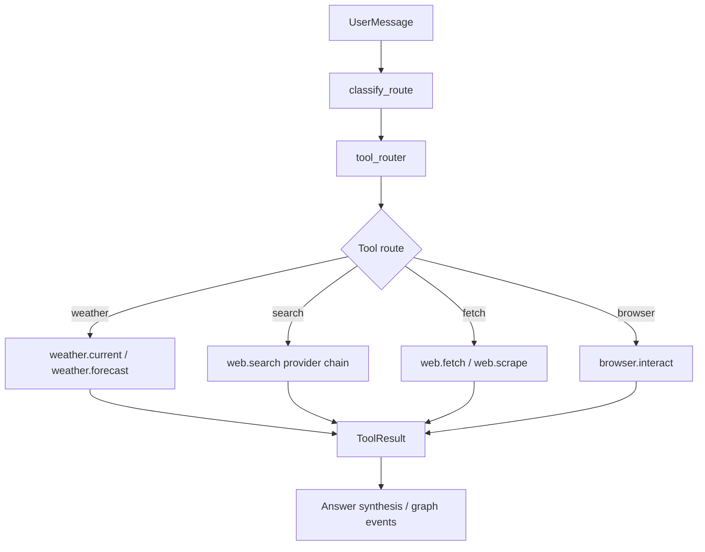

# Web Tool Nodes Design

## Background

Alita already routes user messages through `python/agent_service/graph.py` and
executes generated node graphs through `python/agent_service/execution.py`.
Simple web inquiries currently use `DuckDuckGoHtmlSearchProvider` in
`python/agent_service/web_search.py`. That provider works as a proof of concept,
but it depends on DuckDuckGo HTML access and can fail in the user's network
environment with timeouts such as SSL handshake failures.

The next step is not to replace LangGraph or the Agent framework. The goal is to
add a stable tool-node layer under the existing Agent so route decisions can
invoke purpose-built tools:

- weather data for weather questions
- search providers for general real-time information
- fetch/scrape providers for reading source pages
- browser automation for pages that require interaction

## Goals

- Make weather questions stable without relying on web search pages.
- Replace the single DuckDuckGo search dependency with a provider chain.
- Keep tool calls visible as graph/tool events where appropriate.
- Reuse the existing privacy guard before any outbound query.
- Keep provider details behind small Python interfaces so providers can be
  swapped without changing LangGraph routing.
- Allow API-key providers, local/open providers, and MCP servers to coexist.
- Preserve existing simple inquiry and research graph behavior while improving
  reliability.

## Non-Goals

- Do not replace LangGraph, the current graph executor, or the local model
  client.
- Do not implement a full MCP runtime in the first pass.
- Do not make browser automation the default path for simple questions.
- Do not send local document content, local paths, or private project context to
  external providers by default.
- Do not require a paid API key for weather support.

## Recommended Rollout

### Phase 1: Weather Tool

Add `weather.current` and `weather.forecast` as deterministic tool providers
backed by Open-Meteo. This phase should make prompts like:

```text
今天上海天气怎么样？
```

route to a weather tool instead of DuckDuckGo.

### Phase 2: Provider Chain For Search

Replace the current single-provider default with a chain:

```text
Brave Search API -> Firecrawl Search -> Tavily/Exa -> DuckDuckGo HTML fallback
```

The first implementation can include DuckDuckGo plus one configured provider.
Providers that require keys should be disabled unless their environment
variables are present.

### Phase 3: Fetch And Scrape Tools

Add `web.fetch` and `web.scrape` so research flows can read selected source
pages after search. Firecrawl can be used when configured; a basic fetcher can
remain as fallback for static pages.

### Phase 4: Browser Tool

Add a browser automation tool for JavaScript-heavy or interactive pages using
`browser-use` or Playwright. This should be opt-in by route/tool selection, not
the default web path.

## Architecture



The route classifier should remain responsible for broad intent. A new tool
router should map inquiry subtypes to concrete tools. Tool providers should not
know about LangGraph state; they receive sanitized inputs and return structured
results.

## File Structure

Create a focused provider package:

```text
python/agent_service/tool_providers/
  __init__.py
  weather.py
  web_search.py
  web_fetch.py
  browser.py
```

Add routing and shared contracts:

```text
python/agent_service/tool_router.py
python/agent_service/tool_result.py
```

Modify existing integration points:

```text
python/agent_service/intent.py
python/agent_service/graph.py
python/agent_service/web_search.py
python/agent_service/web_research.py
python/agent_service/execution.py
python/agent_service/schemas.py
```

## Tool Result Contract

Every tool should return a structured result instead of raw provider-specific
payloads.

```python
from dataclasses import dataclass, field
from typing import Any, Literal


ToolStatus = Literal["ok", "failed", "blocked", "not_configured"]


@dataclass(frozen=True)
class ToolFailure:
    kind: str
    message: str
    retryable: bool = False
    provider: str | None = None


@dataclass(frozen=True)
class ToolResult:
    tool_name: str
    status: ToolStatus
    data: dict[str, Any] = field(default_factory=dict)
    sources: list[dict[str, Any]] = field(default_factory=list)
    failure: ToolFailure | None = None
    metadata: dict[str, Any] = field(default_factory=dict)
```

The `data` field is for normalized values such as weather temperature,
conditions, or extracted page text. The `sources` field is for URLs and source
metadata. The `metadata` field can record provider name, timing, query, cache
status, and fallback path.

## Weather Provider

### Tool Names

- `weather.current`
- `weather.forecast`

### Provider

Use Open-Meteo as the first provider because it has a stable JSON API and does
not require an API key.

The provider should:

- geocode city names into latitude and longitude
- request current weather and forecast data
- normalize units to Celsius, km/h, and local time
- return a source URL or provider name in metadata

### Weather Data Shape

```python
{
    "location": "上海",
    "country": "CN",
    "latitude": 31.2304,
    "longitude": 121.4737,
    "temperatureC": 26.1,
    "apparentTemperatureC": 27.3,
    "condition": "partly_cloudy",
    "precipitationMm": 0.0,
    "windSpeedKmh": 12.4,
    "observedAt": "2026-05-23T15:00:00+08:00",
}
```

### Weather Routing

Weather questions should bypass generic search when they ask for:

- today/current weather
- tomorrow weather
- forecast for a city
- rain, temperature, wind, humidity, AQI if supported

Examples:

```text
今天上海天气怎么样？
明天杭州会下雨吗？
北京现在多少度？
```

If the location is missing, ask the user for a city instead of guessing.

## Search Provider Chain

### Tool Name

- `web.search`

### Provider Interface

```python
class WebSearchProvider(Protocol):
    name: str

    def is_configured(self) -> bool:
        ...

    def search(self, query: str) -> SearchResponse:
        ...
```

### Provider Chain Behavior

The chain should:

- run providers in configured priority order
- skip providers that are not configured
- stop on the first provider returning accepted results
- continue on timeout/network failure if another provider is available
- preserve failure details for diagnostics
- return a single `SearchResponse` compatible with existing code

Suggested order:

```text
BraveSearchProvider
FirecrawlSearchProvider
TavilySearchProvider
ExaSearchProvider
DuckDuckGoHtmlSearchProvider
```

First implementation can ship with:

- `DuckDuckGoHtmlSearchProvider` as fallback
- `BraveSearchProvider` if `ALITA_BRAVE_SEARCH_API_KEY` exists
- `FirecrawlSearchProvider` if `ALITA_FIRECRAWL_API_KEY` exists

### Environment Variables

```text
ALITA_WEB_SEARCH_PROVIDER=auto
ALITA_BRAVE_SEARCH_API_KEY=
ALITA_FIRECRAWL_API_KEY=
ALITA_TAVILY_API_KEY=
ALITA_EXA_API_KEY=
ALITA_WEB_SEARCH_TIMEOUT_SECONDS=8
```

`auto` means use the provider chain. A specific provider name should force that
provider for debugging.

## Fetch And Scrape Tools

### Tool Names

- `web.fetch`
- `web.scrape`
- `web.extract`

`web.fetch` should retrieve raw/static page content. `web.scrape` should return
clean readable content. `web.extract` is reserved for a future structured
extraction phase and is not part of the first implementation.

First implementation should use:

- Firecrawl when configured
- current static fetch/extract logic as fallback

Research flows should use search first, then fetch/scrape only accepted sources.

## Browser Tool

### Tool Name

- `browser.interact`

Use this only when static search/fetch cannot satisfy the request. Examples:

- a page requires JavaScript rendering
- a user explicitly asks the Agent to open or inspect a site
- a task requires clicking through a web workflow

Implementation should be Playwright-first inside the app runtime, with
`browser-use` considered for higher-level LLM-driven interactions. The tool
should have clear timeouts and should emit runtime notices for slow pages.

## Privacy Guard

All outbound tool inputs must pass through `sanitize_for_web_search()` or a
tool-specific privacy guard.

Rules:

- Weather tools can send city names and country hints.
- Search tools can send public keywords and public URLs.
- Search tools must not send local filesystem paths, model paths, private file
  contents, secrets, tokens, or full document text.
- Fetch/scrape tools can fetch user-provided public URLs.
- Browser tools need explicit user confirmation before interacting with sites
  that may require authentication or modify remote state.

If privacy guard blocks a query, return a `ToolResult` with status `blocked`
and ask the user for public keywords.

## Graph Integration

### Simple Weather Inquiry

Add a weather route before `web_simple_inquiry` falls through to generic search.

```text
classify_route -> weather_current -> weather.current -> message.created
```

### Simple Web Inquiry

Keep existing `answer_simple_web_inquiry()` behavior, but replace the default
provider with the provider chain.

```text
classify_route -> web_simple_inquiry -> web.search -> source ranking -> answer
```

### Complex Research Flow

Keep current research choice behavior. When the user chooses research flow:

```text
research-query-plan -> web.search
research-source-reading -> web.fetch/web.scrape
research-report-synthesis -> model node
```

The first implementation may leave deterministic synthesis in place. The tool
node contracts should keep model-assisted synthesis as a future compatible
extension without requiring another tool contract change.

## Error Handling

Map provider errors to stable failure kinds:

| failure kind | Meaning | User-facing action |
|---|---|---|
| `not_configured` | selected provider needs an API key | try fallback or explain setup |
| `timeout` | provider timed out | try next provider |
| `network_error` | network, DNS, TLS, blocked site | try next provider |
| `rate_limited` | provider quota exceeded | try next provider or report quota |
| `privacy_blocked` | query contains sensitive local/private data | ask for public keywords |
| `no_results` | provider responded but no useful results | report no reliable sources |
| `parse_error` | provider response shape changed | try next provider |

User-facing messages should name the category in Chinese and avoid exposing
internal stack traces. Developer logs should include provider name and failure
kind.

## Caching

Add short-lived in-memory caching after provider chain is stable:

- weather current: 10 minutes
- weather forecast: 30 minutes
- search results: 15 minutes
- fetched page content: 30 minutes

Cache keys should include provider name, sanitized query or URL, locale, and
date where relevant. Do not cache privacy-blocked queries.

## Tests

Add focused tests:

- weather router recognizes weather questions and location.
- weather provider normalizes Open-Meteo payloads.
- weather provider handles geocoding failures.
- provider chain skips unconfigured providers.
- provider chain falls back after timeout/network failure.
- provider chain stops when accepted results are returned.
- privacy guard blocks local paths before search.
- simple weather inquiry returns a weather answer without calling web search.
- simple web inquiry still works with injected search provider.
- research flow still generates graph and uses search/fetch tool contracts.

## Acceptance Criteria

- Asking `今天上海天气怎么样？` returns a weather answer from `weather.current`
  and does not call DuckDuckGo.
- If the preferred search provider fails, the system tries the next configured
  provider before returning a failure.
- If no provider is configured except DuckDuckGo and DuckDuckGo fails, the user
  receives a clear Chinese message explaining that search failed because the
  provider was unreachable.
- Existing document-processing graph execution still passes.
- Existing `web_simple_inquiry` tests still pass.
- No private local file paths or document contents are sent to external search
  providers by default.

## Open Decisions For Implementation Plan

- Which paid/keyed search provider should be first-class in the initial build:
  Brave, Firecrawl, Tavily, or Exa.
- Whether provider configuration should live only in environment variables for
  the first pass, or also appear in the Preferences UI.
- Whether weather should support AQI in the first pass. Open-Meteo has air
  quality data, but current weather is enough for the initial user request.
