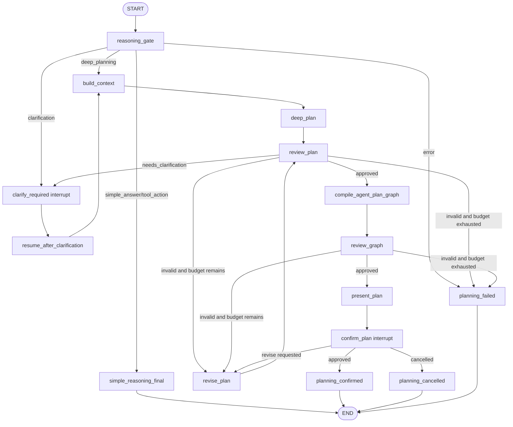

# Deep Planning LangGraph Phase 2 Design

## Purpose

Phase 1 made Alita's task path model-backed: every request now enters a
Reasoning Gate, graph-task planning calls the deep planning model, generated
canvas nodes carry plan-step provenance, and tests prevent the Deep Agent path
from silently falling back to legacy templates.

Phase 2 turns that one-shot planning path into a LangGraph-native deep planning
runtime:

```text
reason -> build context -> deep plan -> review -> revise or clarify
       -> compile graph -> review graph -> ask for confirmation -> resume
```

The goal is not to make the graph appear faster. The goal is to make the graph
traceably derived from durable Agent reasoning, with real checkpoints,
interrupts, resume, revision, and streaming progress.

## Product Principle

Alita remains one Agent. There is no workflow mode and no separate fast mode.

Every user request passes through reasoning. If an execution graph is needed,
the canvas shows the Agent's reasoned plan as a visual execution graph. The
canvas must not become a template renderer with a fake thinking animation.

Phase 2 therefore prioritizes four properties:

1. Deep planning state is durable enough to resume after clarification or user
   confirmation.
2. Planning progress is emitted by real LangGraph node transitions.
3. Failed or invalid plans go through bounded revision or honest failure.
4. The UI can show why a graph exists before any later execution phase runs it.

## Current Baseline

The current Phase 1 implementation lives in:

- `python/agent_service/deep_agent_runtime_graph.py`
- `python/agent_service/deep_agent_planner.py`
- `python/agent_service/deep_agent_models.py`
- `python/agent_service/deep_agent_graph_compile.py`
- `python/agent_service/agent_runtime_engine.py`
- `src/shared/events.ts`
- `src/app/backendEvents.ts`

Current behavior:

- `run_deep_agent_runtime()` compiles a `StateGraph` and calls `app.invoke()`.
- The graph uses `Command(goto=...)` for routing.
- `DeepAgentRuntimeState` is a `TypedDict`.
- Nodes manually carry the full accumulated `events` list forward.
- Clarification and planning failure terminate the graph by returning events.
- There is no LangGraph checkpointer.
- There is no LangGraph interrupt/resume path.
- There is no `revise_plan` node.
- `AgentRuntimeEngine` stores coarse runtime state through `RuntimeStore`, but
  it does not expose LangGraph thread checkpoints for the deep planning graph.

This is an acceptable Phase 1 baseline. It is not yet the desired deep planning
runtime because it is not durable, not interruptible, and not resumable.

## Official LangGraph Guidance

Phase 2 must follow LangGraph's documented runtime model instead of building a
parallel fake planning loop.

The official LangGraph overview describes LangGraph as an orchestration runtime
for long-running, stateful agents, with durable execution, streaming,
human-in-the-loop, and persistence as core capabilities:

- https://docs.langchain.com/oss/python/langgraph/overview

The persistence documentation says compiling a graph with a checkpointer saves
graph state as checkpoints at each execution step, organized by thread. It also
requires `configurable.thread_id` so the checkpointer knows which state to load:

- https://docs.langchain.com/oss/python/langgraph/persistence

The interrupts documentation ties human-in-the-loop behavior to checkpointing:
the checkpointer keeps the graph state so the graph can resume after a human
answer, approval, or edit:

- https://docs.langchain.com/oss/python/langgraph/interrupts

The streaming documentation supports streaming node updates, custom events,
checkpoints, tasks, and multiple modes at once:

- https://docs.langchain.com/oss/python/langgraph/streaming

The installed local version is `langgraph==1.1.10`. It supports
`StateGraph.compile(checkpointer=...)`, `Command`, `interrupt`,
`graph.invoke(..., version="v2")`, `graph.stream(..., version="v2")`,
`get_state()`, `get_state_history()`, and `update_state()`. It does not include
`langgraph.checkpoint.sqlite` in the current Python environment, and the latest
reference site currently documents `langgraph` `1.2.3`. Phase 2 must either add
the official SQLite checkpointer dependency explicitly or keep durable storage
behind a narrow adapter that can be upgraded.

Reference:

- https://reference.langchain.com/python/langgraph/graph/

## Architecture Choice

### Option A: Minimal In-Memory LangGraph Checkpointer

Use `InMemorySaver` only. This proves interrupts and state history in tests, but
it does not survive process restart.

Tradeoff: fastest to build, but not enough for desktop software because user
clarification and plan approval would be lost when the sidecar restarts.

### Option B: Official SQLite Checkpointer

Add the official SQLite checkpointer package and store graph checkpoints in the
project's `node-runs/<run_id>/` area.

Tradeoff: best alignment with LangGraph docs and easiest future migration to
LangGraph's native persistence concepts. It adds a small dependency and requires
careful packaging in the Python sidecar.

### Option C: Custom RunJournal Checkpointer Adapter

Implement a LangGraph checkpointer adapter over Alita's existing `RunJournal`.

Tradeoff: keeps storage fully local to current runtime code, but it couples Alita
to LangGraph's checkpointer interface and increases maintenance risk.

### Recommendation

Use Option B for product code and Option A for focused tests.

The implementation plan should add the official SQLite checkpointer dependency,
wrap it in an Alita-specific factory, and keep the rest of the code depending on
that factory rather than direct imports. If packaging or Windows sidecar build
exposes dependency risk, the factory can fall back to `InMemorySaver` only in
developer/test mode and must emit an explicit degraded durability event.

## Target Runtime Graph

Phase 2 replaces the current one-shot planning path with this graph:



Execution, result verification, and repair remain Phase 3+ work. Phase 2 ends
with a confirmed Agent Plan Graph that is durable and ready for the later
execution connection.

## Runtime State

Phase 2 should keep LangGraph's state as a clear schema. Use `TypedDict` for the
graph state and Pydantic models for persisted or API-facing payloads.

Target fields:

```text
DeepAgentRuntimeState
  message: UserMessage
  project_path: str
  run_id: str
  thread_id: str
  model_client: DeepPlanningModel
  reasoning_decision: ReasoningDecision | None
  context_bundle: dict
  available_capabilities: set[str]
  plan_draft: PlanDraft | None
  plan_review: PlanReview | None
  thinking_status: ThinkingStatus | None
  revision_count: int
  revision_instructions: list[str]
  compiled_graph: RunGraph payload | None
  graph_review: GraphReview | None
  pending_interrupt: dict | None
  confirmation: dict | None
  events: list[AgentEvent]
  trace_spans: list[RuntimeSpan payload]
  terminal_status: planning_confirmed | cancelled | failed | simple_completed | None
```

Use reducers for append-only collections:

```text
events: Annotated[list[AgentEvent], add]
trace_spans: Annotated[list[dict], add]
revision_instructions: Annotated[list[str], add]
```

After introducing reducers, each graph node should return only new events, not
the entire accumulated event list. This prevents duplicated event streams when
LangGraph merges state updates.

## Checkpointing

The deep planning graph must compile with a checkpointer:

```text
build_deep_agent_runtime_graph(checkpointer=...)
```

Every invocation must pass:

```text
config = {
  "configurable": {
    "thread_id": runtime_state.thread_id
  }
}
```

The runtime must capture the latest LangGraph checkpoint id after meaningful
planning stages and mirror a compact checkpoint summary into the existing
`RuntimeStore` so the rest of Alita's UI and run history can still reason about
the active run.

Required checkpoint boundaries:

- after `reasoning_gate`
- after `build_context`
- after `deep_plan`
- after `review_plan`
- after `revise_plan`
- after `compile_agent_plan_graph`
- after `review_graph`
- at clarification interrupt
- at confirmation interrupt
- after confirmation or cancellation

The mirror record should not store raw model hidden reasoning. Store structured
state only: plan draft, reviews, current node name, stage, checkpoint id,
thread id, revision count, and event summaries.

## Interrupt And Resume

Phase 2 uses LangGraph interrupts for two human-in-the-loop cases.

### Clarification

If `reasoning_gate` or `review_plan` determines missing information, the graph
must call `interrupt()` with:

```text
{
  "kind": "planning.clarification",
  "taskId": task_id,
  "threadId": thread_id,
  "question": prompt,
  "missingInputs": [...]
}
```

The backend also emits `planning.clarification_required` so the current frontend
can display the prompt without needing to understand LangGraph internals.

When the user replies, the runtime resumes the same thread with the answer and
rebuilds context before planning again.

### Confirmation

After `review_graph` approves the compiled graph, Phase 2 emits the graph and
interrupts for confirmation:

```text
{
  "kind": "planning.confirmation",
  "taskId": task_id,
  "threadId": thread_id,
  "graphId": graph_id,
  "summary": "...",
  "choices": ["approve", "revise", "cancel"]
}
```

The graph can be shown on the canvas as a reviewed Agent Plan Graph, but it is
not executable until the confirmation resumes with `approve`.

## Bounded Revision

Phase 2 adds `revise_plan`.

Rules:

- `review_plan` may request a revision only when the plan is invalid but the
  missing information can be inferred from available context.
- `review_graph` may request a revision only when the graph fails to represent
  the approved plan.
- Default revision budget is `2`.
- Each revision must call the model through `DeepPlanningEngine.plan()` with
  concrete `revision_instructions`.
- If the revision budget is exhausted, emit `planning.failed`; do not use a
  template graph.

Revision events:

```text
planning.revision_requested
planning.revision_started
planning.revision_completed
planning.revision_exhausted
```

## Streaming And UI

Current frontend reducers already understand several Phase 1 events. Phase 2
should keep those events stable and add richer state events gradually.

The backend should drive user-visible progress from LangGraph streaming modes:

- `updates` for node state changes
- `custom` for sanitized planning events
- `checkpoints` for checkpoint summaries in developer/runtime history views
- `tasks` for node start/finish diagnostics in tests and developer views

Current installed LangGraph supports `graph.stream(..., version="v2")`. The
implementation should not depend on `stream_events(..., version="v3")` until the
project upgrades LangGraph and verifies the API.

Visible planning states:

```text
理解需求
构建上下文
生成深度计划
审查计划
修订计划
编译执行图
审查执行图
等待用户确认
```

The UI must not invent these states. It renders them from backend events.

## Event Contract

Keep existing Phase 1 events:

```text
reasoning.decision_created
reasoning.completed
planning.started
planning.thinking_status
planning.draft_created
planning.review_completed
planning.graph_compiled
planning.graph_review_completed
planning.clarification_required
planning.failed
node_graph.created
```

Add Phase 2 events:

```text
reasoning.started
planning.stage_changed
planning.checkpoint_recorded
planning.revision_requested
planning.revision_started
planning.revision_completed
planning.revision_exhausted
planning.interrupted
planning.resumed
planning.confirmation_required
planning.confirmed
planning.cancelled
```

`planning.checkpoint_recorded` is a planning-level companion to existing
runtime checkpoint events. It should include only safe summary fields:

```text
runId
threadId
checkpointId
stage
node
revisionCount
hasPlanDraft
hasCompiledGraph
createdAt
```

## Backend API Shape

Phase 2 should not require a frontend rewrite.

Keep `submit_user_message` returning `AgentEvent[]`, but teach the request path
to handle resume payloads already represented by `pendingChoice`.

Required backend changes:

- `AgentRuntimeEngine.run_from_state()` passes `run_id` and `thread_id` into
  `run_deep_agent_runtime()`.
- `run_deep_agent_runtime()` accepts an optional resume command.
- `AgentMessageRequest.pendingChoice` can carry clarification or confirmation
  resume data.
- `RuntimeStore` records the mapping from `run_id` to LangGraph `thread_id` and
  latest checkpoint id.
- Existing `RuntimeStore.resume()` remains compatible with execution checkpoint
  resume and does not become a second planning state machine.

## Testing Strategy

Phase 2 is only acceptable with tests that prove LangGraph behavior, not just
event ordering.

Minimum Python tests:

1. Graph compiles with `InMemorySaver` and requires `thread_id` for checkpointed
   runs.
2. State history contains checkpoints after reasoning, planning, and graph
   review.
3. `clarify_required` interrupts before graph creation.
4. Resuming the same `thread_id` with clarification continues planning and can
   create a graph.
5. Approved graph review interrupts for confirmation.
6. Resuming confirmation with `approve` emits `planning.confirmed`.
7. Resuming confirmation with `revise` enters `revise_plan`.
8. Invalid plan with revision budget calls the model again with revision
   instructions.
9. Exhausted revision budget emits `planning.failed`.
10. No revision, clarification, or resume path calls legacy `task_planner`.
11. Streaming mode `updates` or `custom` emits the same planning event sequence
    as non-stream invocation.
12. Checkpoint summaries mirrored to `RuntimeStore` omit raw hidden reasoning and
    local absolute paths.

Minimum frontend tests:

1. `planning.stage_changed` updates the planning panel without adding fake
   progress.
2. `planning.confirmation_required` creates a pending choice.
3. Confirmation approval submits a resume payload.
4. `planning.checkpoint_recorded` appears in developer/runtime history only.
5. Existing `node_graph.created` behavior remains compatible.

Minimum integration tests:

1. Model-backed task request reaches confirmation without legacy planner calls.
2. Clarification request resumes from the same thread id.
3. Restart simulation reloads latest planning checkpoint metadata from project
   storage.
4. Missing or incompatible checkpointer emits explicit degraded durability in
   developer mode and fails in production mode.

## Implementation Notes

The implemented Phase 2 runtime makes `AgentRuntimeEngine` try the LangGraph
deep planning runtime before the legacy router for HTTP agent message entry
points, including `/agent/message` and `/agent/research/choose`. If the deep
runtime emits a terminal planning event such as `node_graph.created`,
`planning.confirmation_required`, `planning.clarification_required`, or
`planning.failed`, the legacy route/template path is not called.

When no usable model client is configured, the HTTP path now returns an explicit
`planning.failed` event instead of silently falling back to legacy templates.
Tests that exercise the HTTP path inject a scripted `chat_with_diagnostics`
model to prove model-backed planning reaches confirmation.

The runtime emits `node_graph.created` before confirmation so the UI can display
the proposed Agent Plan Graph, but the graph is not treated as executable until
the same LangGraph thread resumes from a `planning.confirmation` choice with an
explicit `approve` decision. `revise` resumes the bounded revision path and
`cancel` records a terminal cancellation event.

The frontend preserves reducer-applied planning state across partial stream
failures. Once any backend event has been applied during a streaming submit,
the submit error is marked with `backendEventsApplied`, and the catch path keeps
the current pending planning choice instead of restoring a stale captured
choice.

## Non-Goals

Phase 2 does not implement:

- executing the confirmed graph
- final answer verification
- bounded repair after execution
- multi-agent teams
- raw chain-of-thought display
- autonomous desktop control
- a user-facing workflow/template mode
- unbounded ReAct loops

Execution and repair belong to the next phase after the planning graph becomes
durable and resumable.

## Risks

The biggest technical risk is checkpointer storage. The project already has
`RunJournal` and `RuntimeStore`, but LangGraph's official persistence model has
its own checkpoint interface. The implementation should avoid mixing the two as
equal sources of truth. LangGraph checkpoint state is the planning source of
truth; `RuntimeStore` mirrors safe summaries for Alita compatibility.

The second risk is duplicate event accumulation. The current graph carries the
whole `events` list through every node. Phase 2 should switch to reducers and
node-local event returns before adding streaming.

The third risk is frontend confusion. A reviewed graph may be visible before it
is confirmed. The UI must label it as an Agent Plan Graph awaiting confirmation,
not as an executing workflow.

## Acceptance Criteria

Phase 2 is complete when:

- Deep planning graph compiles with a LangGraph checkpointer.
- Every run uses a stable `thread_id`.
- Clarification and confirmation use LangGraph interrupt/resume.
- `revise_plan` is model-backed and bounded.
- The graph can resume from clarification without regenerating unrelated prior
  state.
- Checkpoint summaries are visible in backend tests and safe to show in
  developer UI.
- Streaming events come from LangGraph execution, not a frontend timer.
- Invalid or unsupported planning never falls back to templates.
- Existing Phase 1 no-template tests still pass.
- Frontend can show confirmation and clarification pending choices.

## Phase 2 Implementation Slices

The later implementation plan should break this into these slices:

1. State schema and reducer cleanup.
2. Checkpointer factory and thread config.
3. RuntimeStore checkpoint mirror.
4. Clarification interrupt/resume.
5. `revise_plan` with bounded model-backed revision.
6. Confirmation interrupt/resume.
7. LangGraph streaming event bridge.
8. Frontend pending-choice handling for confirmation and planning resume.
9. Regression gates and documentation update.

## Sources

- LangGraph overview: https://docs.langchain.com/oss/python/langgraph/overview
- LangGraph persistence: https://docs.langchain.com/oss/python/langgraph/persistence
- LangGraph interrupts: https://docs.langchain.com/oss/python/langgraph/interrupts
- LangGraph streaming: https://docs.langchain.com/oss/python/langgraph/streaming
- LangGraph fault tolerance: https://docs.langchain.com/oss/python/langgraph/fault-tolerance
- LangGraph graph reference: https://reference.langchain.com/python/langgraph/graph/
