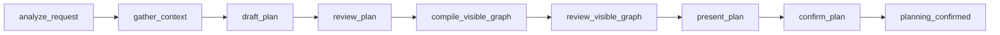
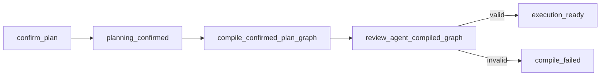

# Agent Plan Graph Compile Phase 3 Design

## Status

Approved direction: Option 2, add a dedicated Agent Plan Graph Compile layer after Phase 2 planning confirmation.

This document is written for the Phase 2 worktree and assumes Phase 2 delivers a confirmed, user-visible Agent Plan Graph from the LangGraph planning runtime.

## Why Phase 3 Exists

Phase 2 makes the agent think before presenting a plan. The plan is no longer a template projection. It is produced through the deep planning LangGraph, reviewed, optionally revised, and confirmed by the user.

Phase 3 answers the next question:

When the user confirms the plan graph, how does the system prove that the visible plan can become a real executable contract?

The current visual `RunGraph` is not enough. It can show nodes and edges, but it does not fully describe:

- which tool or model call will run for each step,
- what input and output contract each step has,
- what permissions and risk gates apply,
- what artifacts each step is expected to create,
- what verification criteria must be preserved,
- how the runtime can reject unsupported plans without silently falling back to a workflow template,
- how later execution, verification, and repair phases can consume the confirmed plan safely.

Phase 3 adds this compile boundary. It does not execute the graph yet.

## Official LangGraph Sources

The implementation should continue to follow the official LangGraph model for graph state, conditional edges, interrupts, persistence, streaming, and subgraphs:

- Graph API: https://docs.langchain.com/oss/python/langgraph/graph-api
- Persistence: https://docs.langchain.com/oss/python/langgraph/persistence
- Interrupts: https://docs.langchain.com/oss/python/langgraph/interrupts
- Streaming: https://docs.langchain.com/oss/python/langgraph/streaming
- Subgraphs: https://docs.langchain.com/oss/python/langgraph/use-subgraphs
- Python reference: https://reference.langchain.com/python/langgraph/graph/

Phase 3 should use these as implementation constraints, not as decorative references. In particular, the compile phase should be a real LangGraph node or subgraph step in the persisted planning runtime, not a separate UI-only simulation.

## Phase 2 Baseline

Phase 2 is expected to provide:

- `build_deep_agent_runtime_graph()` with LangGraph checkpoint support.
- Stable `thread_id` based planning sessions.
- Clarification and confirmation via LangGraph `interrupt` and resume.
- Bounded plan revision.
- `compile_agent_plan_graph()` that turns `PlanDraft` into a visible `RunGraph`.
- `review_compiled_graph()` that checks visible graph integrity.
- `planning.graph_compiled`, `planning.graph_review_completed`, `node_graph.created`, and `planning.confirmed` events.
- No legacy template fallback for deep planning.

Existing local modules that Phase 3 should compose with:

- `python/agent_service/deep_agent_runtime_graph.py`
- `python/agent_service/deep_agent_graph_compile.py`
- `python/agent_service/execution_graph.py`
- `python/agent_service/action_graph.py`
- `python/agent_service/execution.py`
- `python/agent_service/schemas.py`
- `src/shared/events.ts`

## Non-Goals

Phase 3 does not implement:

- graph execution,
- step result verification,
- automatic repair loops,
- autonomous desktop control,
- long-running task orchestration,
- multi-agent delegation,
- new tool catalog expansion,
- private chain-of-thought display,
- replacement of the existing execution runtime.

Those are later phases. Phase 3 creates the executable contract that later phases can trust.

## Core Product Principle

The node canvas remains a plan visualization, but it must reflect a real agent-derived plan. Phase 3 must preserve this principle:

The agent does not pick a template and decorate it. The agent reasons into a plan, the runtime reviews that plan, the user confirms it, and only then the compiler derives an execution-ready contract from the confirmed graph.

If the graph cannot be compiled, the system must say so. It must not silently coerce the graph into a legacy workflow or pretend it is execution-ready.

## Architecture Choice

Three approaches were considered:

1. Reuse `compile_execution_graph()` directly after confirmation.
2. Add an Agent Plan Graph Compile layer that validates plan provenance and then composes with execution graph compilation.
3. Implement a complete execute, verify, and repair loop immediately.

Selected approach: option 2.

Reasoning:

- Option 1 is too thin. It can validate graph shape, but it does not prove the graph came from deep planning, preserve user confirmation semantics, or carry plan-specific verification contracts.
- Option 3 is too broad. It would mix compile, execution, verification, and repair before the compile boundary is trustworthy.
- Option 2 gives a narrow, testable Phase 3 boundary and prepares the system for later execution phases.

## Target Runtime Flow

Phase 2 flow:



Phase 3 adds compile and execution-ready states:



The compiler runs only after the confirmation interrupt resumes with approval.

## LangGraph Shape

The Phase 3 LangGraph extension should be implemented as explicit nodes in the deep agent runtime graph:

- `compile_confirmed_plan_graph`
- `review_agent_compiled_graph`
- `execution_ready`
- `compile_failed`

The state should add:

- `agent_compiled_graph`
- `agent_compile_review`
- `execution_ready`
- `compile_failure`

The graph should route:

- approved confirmation -> `planning_confirmed`
- `planning_confirmed` -> `compile_confirmed_plan_graph`
- compile success -> `review_agent_compiled_graph`
- review pass -> `execution_ready`
- compile or review failure -> `compile_failed`

The compile stage must remain checkpointed through the same LangGraph checkpointer used by the planning runtime.

## Compile Contract

Add a backend compile contract module:

`python/agent_service/agent_plan_compile.py`

Recommended public API:

```python
def compile_confirmed_agent_plan_graph(
    graph: RunGraph,
    *,
    task_id: str,
    run_id: str,
    thread_id: str,
    confirmation_id: str,
    tool_registry: ToolRegistry | None = None,
) -> AgentCompiledGraph:
    ...

def review_agent_compiled_graph(
    compiled_graph: AgentCompiledGraph,
) -> AgentCompileReview:
    ...
```

The compiler should compose with the existing execution compiler:

```python
execution_graph = compile_execution_graph(
    RunGraphRequest(
        taskId=task_id,
        graph=graph,
    ),
    tool_registry=tool_registry,
)
```

The Agent compile layer should not duplicate all execution compilation rules. It should add the missing agent-specific guardrails and metadata contracts around the existing compiler.

## AgentCompiledGraph Shape

The exact Pydantic names can follow local style, but the contract should include these fields:

```python
class AgentCompiledGraph(BaseModel):
    compile_id: str
    compile_fingerprint: str
    task_id: str
    run_id: str
    thread_id: str
    confirmation_id: str
    source_graph_id: str
    source_plan_draft_id: str
    source_planning_trace_id: str | None
    status: Literal["compiled", "reviewed", "execution_ready", "failed"]
    nodes: list[AgentCompiledNode]
    edges: list[GraphEdge]
    execution_graph: ExecutionGraph
    action_graph: RuntimeActionGraph
    success_criteria: list[str]
    verification_plan: list[str]
    permissions_required: list[str]
    expected_artifacts: list[ExpectedArtifact]
    metadata: dict[str, Any]
```

Recommended node contract:

```python
class AgentCompiledNode(BaseModel):
    node_id: str
    node_type: Literal["fixed_tool", "model", "output", "control"]
    source_plan_step_id: str
    dependencies: list[str]
    binding_kind: Literal["tool", "model", "output", "control"]
    tool_contract: AgentCompiledToolContract | None = None
    model_contract: AgentCompiledModelContract | None = None
    expected_output: str
    verification_criteria: list[str]
    required_capabilities: list[str]
    permissions_required: list[str]
    risk_level: str | None = None
    metadata: dict[str, Any]
```

Recommended review contract:

```python
class AgentCompileReview(BaseModel):
    is_valid: bool
    issues: list[AgentCompileIssue]
    unsupported_capabilities: list[str]
    missing_bindings: list[str]
    execution_ready: bool
```

## Required Compiler Invariants

The compiler must enforce these conditions:

- `graph.metadata.generatedBy == "deep_agent_runtime"`.
- `graph.metadata.sourcePlanDraftId` exists.
- `graph.metadata.modelPolicy == "deep_reasoning"`.
- `graph.metadata.successCriteria` is preserved.
- `graph.metadata.verificationPlan` is preserved.
- Every executable node has `metadata.sourcePlanStepId`.
- Every executable node has `metadata.expectedOutput`.
- Every executable node has `metadata.verificationCriteria`.
- Every executable node has `metadata.requiredCapabilities`.
- Every fixed tool node has a resolvable tool binding and operation.
- Every model node has a model binding contract.
- Edge dependencies match node dependency metadata.
- Unsupported capabilities produce compile failure, not fallback.
- Template or legacy graphs without deep planning provenance are rejected.
- The compile fingerprint changes if graph nodes, edges, bindings, verification criteria, or source plan metadata change.
- No execution starts during Phase 3.

## Binding Policy

Phase 2 currently creates fixed tool nodes for document-oriented capabilities and model nodes for unsupported or reasoning-heavy steps.

Phase 3 should make this explicit:

- Fixed tool nodes compile into `AgentCompiledToolContract`.
- Model nodes compile into `AgentCompiledModelContract`.
- Output nodes compile into an output contract if present.
- Unsupported fixed tool bindings fail compilation.
- Model fallback is allowed only when Phase 2 deliberately emitted a `model` node with `modelRef`, not when a fixed tool binding is missing.

This distinction matters. A missing tool binding must not be hidden by converting the node into a generic model call at compile time.

## Confirmation Semantics

The user confirms the visible graph. Therefore Phase 3 must compile exactly that confirmed graph.

The runtime state should retain:

- `compiled_graph` from Phase 2,
- confirmation decision and confirmation payload,
- `agent_compiled_graph` from Phase 3,
- compile review result.

If the user asks for revision during confirmation, Phase 3 does not run. The system returns to the Phase 2 revision path.

If the user cancels, Phase 3 does not run.

## Events

Add shared event variants:

- `agent_plan_graph.compile_started`
- `agent_plan_graph.compiled`
- `agent_plan_graph.compile_review_completed`
- `agent_plan_graph.execution_ready`
- `agent_plan_graph.compile_failed`

Event payloads should include stable IDs:

```ts
type AgentPlanGraphCompileEventPayload = {
  taskId: string;
  runId: string;
  threadId: string;
  graphId: string;
  compileId: string;
};
```

`execution_ready` should include a summary, not the full raw execution graph unless the existing event transport already handles that safely:

```ts
type AgentPlanGraphExecutionReadyPayload = AgentPlanGraphCompileEventPayload & {
  nodeCount: number;
  edgeCount: number;
  toolNodeCount: number;
  modelNodeCount: number;
  permissionsRequired: string[];
  expectedArtifacts: string[];
};
```

The frontend should use these events to show honest runtime state:

- planning confirmed,
- compiling confirmed graph,
- compile reviewed,
- execution ready,
- compile failed.

The UI must not imply execution is happening in Phase 3.

## Persistence

The LangGraph checkpoint should contain the complete Phase 3 state required to resume the planning session.

The existing runtime store or run journal should persist a compact compile summary:

- task ID,
- run ID,
- thread ID,
- source graph ID,
- compile ID,
- compile fingerprint,
- status,
- issue count,
- node count,
- permissions required,
- expected artifact labels.

This summary is for product history and debugging. The source of truth for resumable runtime state remains the LangGraph checkpoint.

## Error Policy

Compile errors are product-significant. They should be surfaced as agent runtime failures, not hidden as internal exceptions.

Compile failure should emit:

- the graph ID,
- compile ID when available,
- issue list,
- unsupported capabilities,
- missing bindings,
- a short user-safe reason.

Do not include private chain-of-thought or raw provider prompts in event payloads.

## Frontend Impact

Frontend changes should be small:

- add new event type definitions in `src/shared/events.ts`,
- update runtime event reducer or planning panel state,
- show compile status after plan confirmation,
- keep the confirmed node canvas visible,
- show compile failure as a real blocker,
- do not add a second planning mode,
- do not show private reasoning traces.

The canvas does not need a new layout. Phase 3 is primarily a runtime contract feature.

## Test Strategy

Backend unit tests:

- valid deep planning graph compiles into `AgentCompiledGraph`;
- compile preserves plan provenance;
- compile preserves success criteria and verification plan;
- fixed tool node without binding fails;
- legacy graph without `generatedBy: deep_agent_runtime` fails;
- unsupported capability fails honestly;
- compile fingerprint is stable for identical graph input;
- compile fingerprint changes when bindings or verification criteria change.

Runtime tests:

- approval resumes confirmation interrupt and then emits compile events;
- cancel does not compile;
- revise does not compile;
- compile failure emits `agent_plan_graph.compile_failed`;
- successful compile reaches `execution_ready`;
- no execution events are emitted in Phase 3.

Frontend tests:

- new event variants parse correctly;
- reducer records compile status;
- execution-ready summary renders without implying execution.

## Definition Of Done

Phase 3 is complete when:

- the confirmed Agent Plan Graph compiles into an `AgentCompiledGraph`;
- compilation is represented as persisted LangGraph state;
- compile and review events stream through the existing app event channel;
- legacy or template graphs cannot be marked as agent execution-ready;
- fixed tool binding failures are surfaced without fallback;
- user confirmation semantics are preserved;
- the frontend can show compile status and execution-ready state honestly;
- tests cover compile success, compile failure, confirmation routing, and event handling;
- no graph execution starts as part of Phase 3.
