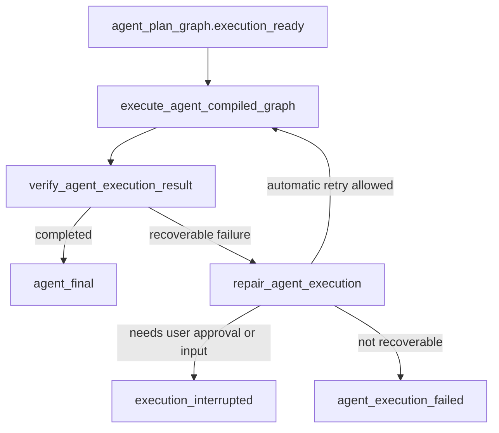

# Execute, Verify, Repair Phase 5 Design

## Status

Phase 5 is the remaining unfinished stage from
`2026-06-01-deep-agent-reasoning-runtime-design.md`.

Phase 4 removed the product fallback from Deep Agent planning to legacy task graph
creation. Phase 5 now connects the confirmed and compiled Agent plan to actual
execution.

## Purpose

Phase 5 turns this terminal planning state:

```text
agent_plan_graph.execution_ready
```

into this Agent runtime continuation:

```text
execute_agent_compiled_graph
  -> verify_agent_execution_result
  -> repair_agent_execution or final
```

The execution input is the Phase 3 `AgentCompiledGraph`. The runtime must not
execute a graph merely because a legacy planner produced one.

## Product Principle

The user confirms an Agent-derived plan, not a workflow template.

Execution must preserve that provenance:

```text
AgentCompiledGraph
  -> sourcePlanDraftId
  -> sourcePlanStepId per node
  -> execution events
  -> verification result
  -> repair or final
```

If the compiled graph is missing, invalid, not `execution_ready`, or not generated
by the Deep Agent runtime, Phase 5 fails honestly.

## Official LangGraph Sources

Phase 5 should continue using LangGraph state, checkpointing, and streaming as
runtime concerns:

- Graph API: https://docs.langchain.com/oss/python/langgraph/graph-api
- Persistence: https://docs.langchain.com/oss/python/langgraph/persistence
- Interrupts: https://docs.langchain.com/oss/python/langgraph/interrupts
- Streaming: https://docs.langchain.com/oss/python/langgraph/streaming
- Subgraphs: https://docs.langchain.com/oss/python/langgraph/use-subgraphs

Implementation constraints:

- Add execution as real LangGraph node transitions, not UI-only progress text.
- Keep checkpointed state after execution and verification decisions.
- Preserve interrupt/resume semantics for permission and missing-input failures.
- Stream execution and verification events from actual runtime outcomes.

## Baseline

Existing reusable modules:

- `python/agent_service/agent_plan_compile.py`
  Defines `AgentCompiledGraph`, node contracts, provenance, and execution-ready
  review.

- `python/agent_service/execution.py`
  Defines `run_graph_events()`, `PlannedTaskExecutor`, result verification,
  final verification, checkpoint writes, recovery suggestions, and resume modes.

- `python/agent_service/result_verifier.py`
  Provides node-level output verification.

- `python/agent_service/final_verifier.py`
  Verifies final output artifacts.

- `python/agent_service/replan.py`
  Provides bounded failure suggestions such as retry, rerun, rerun from node, or
  ask user for tool enablement.

Phase 5 should compose with these modules rather than replace them.

## Target Runtime Flow



## LangGraph State Additions

Extend `DeepAgentRuntimeState` with:

```text
agent_execution_result
agent_execution_review
execution_failure
execution_repair_plan
execution_repair_count
execution_events
final_response
```

The persisted JSON models should live in a new file:

```text
python/agent_service/agent_execution_runtime.py
```

Recommended public models:

```text
AgentExecutionRunResult
  status: completed | failed | interrupted
  taskId
  runId
  threadId
  compileId
  graphId
  completedNodeIds
  failedNodeId
  artifactRefs
  checkpointIds
  recoveryActions
  finalMessage

AgentExecutionReview
  status: approved | failed | needs_repair
  isValid
  issues
  finalArtifacts
  repairRequired
```

## Execution Bridge

Add a bridge that turns an `AgentCompiledGraph` into a `RunGraphRequest`:

```text
AgentCompiledGraph.execution_graph.source RunGraph
  -> RunGraphRequest
  -> run_graph_events()
  -> AgentExecutionRunResult
```

The bridge must enforce:

1. `compiled_graph.status == "execution_ready"`.
2. `compiled_graph.metadata.generatedBy == "deep_agent_runtime"`.
3. every executable node has `source_plan_step_id`.
4. request `run_id` stays tied to the Deep Agent run.
5. generated events are tagged with compile and planning provenance.

## Verification

Phase 5 has two verification layers:

1. Existing execution verification:
   `ResultVerifier`, `FinalVerifier`, and existing `run_graph_events()`.

2. Agent-level verification:
   confirm the execution result satisfies the compiled graph's
   `success_criteria`, `verification_plan`, expected artifacts, and final output
   contract.

The first Phase 5 slice can implement deterministic Agent-level review:

- failed task event -> `needs_repair` or `failed`;
- completed task event but missing expected artifact -> `failed`;
- completed task event and expected artifacts present -> `approved`.

Model-adjudicated quality review can be a later enhancement.

## Repair

Existing `FailureReplanner` already proposes bounded actions for runtime errors.
Phase 5 should capture these suggestions as `execution_repair_plan`.

Allowed first-slice repair behavior:

- automatic retry only for suggestions marked automatic and only within a small
  `execution_repair_budget`;
- user interrupt when repair requires approval or missing input;
- honest failure when no repair is available.

Phase 5 should not create a new plan draft or recompile the full plan. Full
replanning belongs to a later phase after execution results can be trusted.

## Events

Add backend/frontend event contracts:

```text
agent_execution.started
agent_execution.event_forwarded
agent_execution.completed
agent_execution.verify_completed
agent_execution.repair_proposed
agent_execution.interrupted
agent_execution.failed
agent_execution.final
```

The existing low-level execution events such as `run.started`, `node.running`,
`node.completed`, `checkpoint_recorded`, `recovery.action_proposed`, and
`task.completed` should still be streamed. Phase 5 events summarize how those
events relate to the Agent plan.

## Non-Goals

Phase 5 does not implement:

- private chain-of-thought display,
- multi-agent delegation,
- autonomous desktop control,
- a new tool catalog,
- full plan regeneration after failure,
- execution of legacy template graphs as the Agent product path.

## Acceptance Criteria

Phase 5 is complete when:

1. `AgentCompiledGraph` can be executed through a Deep Agent runtime node.
2. Execution events stream from real `run_graph_events()` output.
3. Runtime state records completed, failed, or interrupted execution results.
4. Final verification emits an Agent-level review event.
5. Recoverable failures produce bounded repair suggestions.
6. Permission or user-input failures interrupt instead of pretending success.
7. Legacy template graphs cannot enter the Phase 5 execution bridge.
